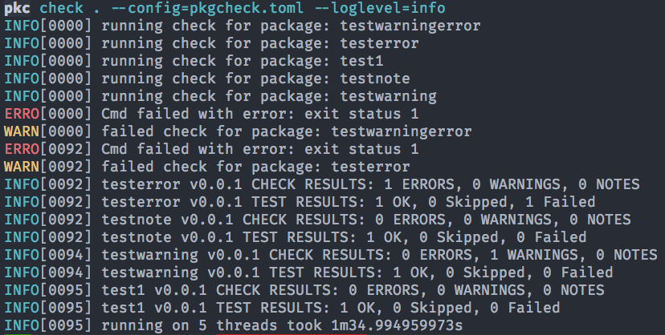

README 
============

## CLI

The initial mechanism for running package checks is through a cli program called `pkc`

```bash
pkc check <tarball>
```



## Development Process

Development past the initial scaffolding will be based on a git-flow style of feature/bug/etc being worked on 
in a separate branch, with pull-requests into the master branch tracking the changes and discussion
related to that activiity. 

## Organization

Go-code follows best-practices established in the go community around package organization, naming, and implementation.

The following go packages provide 

* cmd - CLI commands
* configlib - global configuration and settings
* rcmd - implementation of the rcmds
* rcmdparser - parsing and management of the rcmd outputs
* db - database of outputs stored from running the rcmdchecks