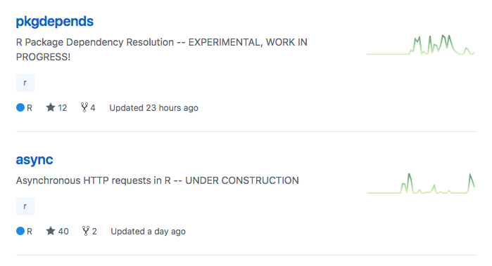

# Motivation

The primary motivation around the development of the package check tooling is to provide a system to run checks against cohorts
of packages to assess the compatability across packages. As development needs extend beyond CRAN, or across package versions
not tied to the most recent version of all packages (which CRAN checks), tooling to mimic the CRAN checks can provide the
same degree of confidence. Furthermore, CRAN is currently going through a number of "growing-pains" associated with the exponential
expansion of packages they are supporting. Certain foundational packages, such as `processx` have been stuck for months in
limbo, without dialog with the CRAN maintainers, causing hoops such as embedding into other packages https://github.com/r-lib/processx/issues/94.

To address this, a flexible system to run similar checks to those CRAN provides, while allowing customization as to the
scrutiny of the checks will be important to confidently construct package cohorts. Likewise, to support environments with
rigorous change control processes and/or continuous integration activities, minimizing runtime dependencies is valuable.

## Dependency Checks

## Reverse Dependency Checks

Overall, revdepcheck's are generally done by a package maintainer in preparation to submit to CRAN.
As CRAN requires the most recent set of packages to be compatible, to update a given package (Package A), all packages that depend
on package A must still pass the `R CMD CHECK` with the new version. Hence, it becomes an upgrade cycle of fixing/updating all
reverse packages before the new package can also be added.

## Prior/ongoing efforts

* `devtools::check()` - in development package
* `rcmdcheck` package - package dependencies
* `revdepcheck` package - package reverse dependencies
* `prrd` package - package reverse dependencies

## Differences

`devtools::check()` is built around checking an in-development package in a particular folder on a developers computer.
This tooling is expected to check package cohorts provided in a runtime or in a project folder, hence is different in scope.

The `rcmdcheck` package is designed around providing optimal feedback for a developer working on their specific package.
The package has not had much development activity, and still has low (~37%) test coverage in comparison to most of the
r-lib organization packages (generally > 80%). Feature-wise, the core features do align with the objectives of
checking a specific package, however no functionality towards checking multiple packages in a cohort is provided.
Likewise, new feature development is not prioritized; for example, https://github.com/r-lib/rcmdcheck/issues/12,
discussed in 2016, shows that features that are important to managing scenarios other than submission to CRAN,
have not had progress. Most importantly, `rcmdcheck` is not actively following the ongoing development progress within r-lib.
For example, pointing to a old remote version of `callr` 1 major version behind.

`rcmdcheck` could potentially be 'adopted' by amgen or others willing to take on maintainence,
however still brings up the issue of minimizing runtime dependencies, as well as implementing features around
parallel checks and needs specific to amgen (eg passing all requirements to submit to CRAN is not a problem).
This option is seen as "moderate risk", as without significant communication with the Rstudio team developing the packages.
To our knowledge no external influences (eg corporate funding to prioritize certain features)
have been shown to handle the development cycles of the packages. For example, a
priority bug fix or refactor required by Amgen could be implemented, but sit as a pull request for an indeterminate
length of time, and even then no guarantees on acceptance can be made.

`revdepcheck` has the same risks associated with rcmdcheck. The focus is on the existing infrastructure and setup of the community
around CRAN. Feature such as sending emails to maintainers with issues, though highly relevant for package maintainers, are
not structured in a way to migrate cohorts of packages or provide the audit summaries that may be required to support
maintaining an internal subset of CRAN.

## Dependency analysis

To use the tooling provided in the r-lib organization, shows dependencies of 55 packages on CRAN and 19 packages on github. This
dependency set is currently unstable and undergoing extensive iteration. Inclusion of any piece brings inherent risk
as the SDLC across the r-lib organization is not formally defined and packages frequently become out of date (at least temporarily)
until the next update cycle.

The user stories identified do not present any pressing implementation need from the organization packages that would require
significant (> 5 day) re-write under the new proposal. Hence, the recommendation is to not use any packages for now.

This may change to expose and use some of the parsing or processing capabilities for summaries or other metadata management. Likewise,
as these packages mature they may be leveraged as a component of the parallelization infrastructure if value-add can be demonstrated.

The following dependency tree was constructed representing the dependency tree based on utilizing the following packages
from `r-lib` organization as of March 2018:

* r-lib/pkgdepends
* r-lib/rcmdcheck
* r-lib/pkginstall
* r-lib/pkgbuild
* r-lib/revdepcheck
* r-lib/pkgman

```
pkginstall (0.0.0.9001)
├─callr (2.0.2.9001)
│ ├─assertthat (0.2.0)
│ ├─crayon (1.3.4)
│ ├─debugme (1.1.0)
│ │ └─crayon (1.3.4)
│ ├─R6 (2.2.2)
│ └─testthat (2.0.0)
│   ├─cli (1.0.0.9002)
│   │ ├─ansistrings (1.0.0.9000)
│   │ │ └─crayon (1.3.4)
│   │ ├─assertthat (0.2.0)
│   │ ├─crayon (1.3.4)
│   │ ├─glue (1.2.0.9000)
│   │ ├─progress (1.1.2.9002)
│   │ │ ├─hms (0.4.2)
│   │ │ │ ├─pkgconfig (2.0.1)
│   │ │ │ └─rlang (0.2.0.9000)
│   │ │ ├─prettyunits (1.0.2)
│   │ │ │ ├─magrittr (1.5)
│   │ │ │ └─assertthat (0.2.0)
│   │ │ ├─R6 (2.2.2)
│   │ │ └─crayon (1.3.4)
│   │ ├─R6 (2.2.2)
│   │ ├─selectr (0.3-2)
│   │ │ └─stringr (1.3.0)
│   │ │   ├─glue (1.2.0.9000)
│   │ │   ├─magrittr (1.5)
│   │ │   └─stringi (1.1.7)
│   │ ├─withr (2.1.2)
│   │ └─xml2 (1.2.0)
│   │   └─Rcpp (0.12.16)
│   ├─crayon (1.3.4)
│   ├─digest (0.6.15)
│   ├─magrittr (1.5)
│   ├─praise (1.0.0)
│   ├─R6 (2.2.2)
│   ├─rlang (0.2.0.9000)
│   └─withr (2.1.2)
├─cli (1.0.0.9002)
│ ├─ansistrings (1.0.0.9000)
│ │ └─crayon (1.3.4)
│ ├─assertthat (0.2.0)
│ ├─crayon (1.3.4)
│ ├─glue (1.2.0.9000)
│ ├─progress (1.1.2.9002)
│ │ ├─hms (0.4.2)
│ │ │ ├─pkgconfig (2.0.1)
│ │ │ └─rlang (0.2.0.9000)
│ │ ├─prettyunits (1.0.2)
│ │ │ ├─magrittr (1.5)
│ │ │ └─assertthat (0.2.0)
│ │ ├─R6 (2.2.2)
│ │ └─crayon (1.3.4)
│ ├─R6 (2.2.2)
│ ├─selectr (0.3-2)
│ │ └─stringr (1.3.0)
│ │   ├─glue (1.2.0.9000)
│ │   ├─magrittr (1.5)
│ │   └─stringi (1.1.7)
│ ├─withr (2.1.2)
│ └─xml2 (1.2.0)
│   └─Rcpp (0.12.16)
├─crayon (1.3.4)
├─desc (1.1.1.9002)
│ ├─assertthat (0.2.0)
│ ├─R6 (2.2.2)
│ ├─crayon (1.3.4)
│ └─rprojroot (1.3-2)
│   └─backports (1.1.2)
├─filelock (1.0.1)
├─glue (1.2.0.9000)
├─pkgbuild (0.0.0.9001)
│ ├─callr (2.0.2.9001)
│ │ ├─assertthat (0.2.0)
│ │ ├─crayon (1.3.4)
│ │ ├─debugme (1.1.0)
│ │ │ └─crayon (1.3.4)
│ │ ├─R6 (2.2.2)
│ │ └─testthat (2.0.0)
│ │   ├─cli (1.0.0.9002)
│ │   │ ├─ansistrings (1.0.0.9000)
│ │   │ │ └─crayon (1.3.4)
│ │   │ ├─assertthat (0.2.0)
│ │   │ ├─crayon (1.3.4)
│ │   │ ├─glue (1.2.0.9000)
│ │   │ ├─progress (1.1.2.9002)
│ │   │ │ ├─hms (0.4.2)
│ │   │ │ │ ├─pkgconfig (2.0.1)
│ │   │ │ │ └─rlang (0.2.0.9000)
│ │   │ │ ├─prettyunits (1.0.2)
│ │   │ │ │ ├─magrittr (1.5)
│ │   │ │ │ └─assertthat (0.2.0)
│ │   │ │ ├─R6 (2.2.2)
│ │   │ │ └─crayon (1.3.4)
│ │   │ ├─R6 (2.2.2)
│ │   │ ├─selectr (0.3-2)
│ │   │ │ └─stringr (1.3.0)
│ │   │ │   ├─glue (1.2.0.9000)
│ │   │ │   ├─magrittr (1.5)
│ │   │ │   └─stringi (1.1.7)
│ │   │ ├─withr (2.1.2)
│ │   │ └─xml2 (1.2.0)
│ │   │   └─Rcpp (0.12.16)
│ │   ├─crayon (1.3.4)
│ │   ├─digest (0.6.15)
│ │   ├─magrittr (1.5)
│ │   ├─praise (1.0.0)
│ │   ├─R6 (2.2.2)
│ │   ├─rlang (0.2.0.9000)
│ │   └─withr (2.1.2)
│ ├─crayon (1.3.4)
│ ├─desc (1.1.1.9002)
│ │ ├─assertthat (0.2.0)
│ │ ├─R6 (2.2.2)
│ │ ├─crayon (1.3.4)
│ │ └─rprojroot (1.3-2)
│ │   └─backports (1.1.2)
│ ├─R6 (2.2.2)
│ ├─rprojroot (1.3-2)
│ │ └─backports (1.1.2)
│ ├─withr (2.1.2)
│ ├─Rcpp (0.12.16)
│ ├─testthat (2.0.0)
│ │ ├─cli (1.0.0.9002)
│ │ │ ├─ansistrings (1.0.0.9000)
│ │ │ │ └─crayon (1.3.4)
│ │ │ ├─assertthat (0.2.0)
│ │ │ ├─crayon (1.3.4)
│ │ │ ├─glue (1.2.0.9000)
│ │ │ ├─progress (1.1.2.9002)
│ │ │ │ ├─hms (0.4.2)
│ │ │ │ │ ├─pkgconfig (2.0.1)
│ │ │ │ │ └─rlang (0.2.0.9000)
│ │ │ │ ├─prettyunits (1.0.2)
│ │ │ │ │ ├─magrittr (1.5)
│ │ │ │ │ └─assertthat (0.2.0)
│ │ │ │ ├─R6 (2.2.2)
│ │ │ │ └─crayon (1.3.4)
│ │ │ ├─R6 (2.2.2)
│ │ │ ├─selectr (0.3-2)
│ │ │ │ └─stringr (1.3.0)
│ │ │ │   ├─glue (1.2.0.9000)
│ │ │ │   ├─magrittr (1.5)
│ │ │ │   └─stringi (1.1.7)
│ │ │ ├─withr (2.1.2)
│ │ │ └─xml2 (1.2.0)
│ │ │   └─Rcpp (0.12.16)
│ │ ├─crayon (1.3.4)
│ │ ├─digest (0.6.15)
│ │ ├─magrittr (1.5)
│ │ ├─praise (1.0.0)
│ │ ├─R6 (2.2.2)
│ │ ├─rlang (0.2.0.9000)
│ │ └─withr (2.1.2)
│ └─covr (3.0.1)
│   ├─jsonlite (1.5)
│   ├─rex (1.1.2)
│   │ ├─magrittr (1.5)
│   │ └─lazyeval (0.2.1)
│   ├─httr (1.3.1)
│   │ ├─jsonlite (1.5)
│   │ ├─mime (0.5)
│   │ ├─curl (3.1)
│   │ ├─openssl (1.0.1)
│   │ └─R6 (2.2.2)
│   ├─crayon (1.3.4)
│   └─withr (2.1.2)
├─prettyunits (1.0.2)
│ ├─magrittr (1.5)
│ └─assertthat (0.2.0)
├─R6 (2.2.2)
├─rlang (0.2.0.9000)
├─covr (3.0.1)
│ ├─jsonlite (1.5)
│ ├─rex (1.1.2)
│ │ ├─magrittr (1.5)
│ │ └─lazyeval (0.2.1)
│ ├─httr (1.3.1)
│ │ ├─jsonlite (1.5)
│ │ ├─mime (0.5)
│ │ ├─curl (3.1)
│ │ ├─openssl (1.0.1)
│ │ └─R6 (2.2.2)
│ ├─crayon (1.3.4)
│ └─withr (2.1.2)
├─mockery (0.4.1)
│ └─testthat (2.0.0)
│   ├─cli (1.0.0.9002)
│   │ ├─ansistrings (1.0.0.9000)
│   │ │ └─crayon (1.3.4)
│   │ ├─assertthat (0.2.0)
│   │ ├─crayon (1.3.4)
│   │ ├─glue (1.2.0.9000)
│   │ ├─progress (1.1.2.9002)
│   │ │ ├─hms (0.4.2)
│   │ │ │ ├─pkgconfig (2.0.1)
│   │ │ │ └─rlang (0.2.0.9000)
│   │ │ ├─prettyunits (1.0.2)
│   │ │ │ ├─magrittr (1.5)
│   │ │ │ └─assertthat (0.2.0)
│   │ │ ├─R6 (2.2.2)
│   │ │ └─crayon (1.3.4)
│   │ ├─R6 (2.2.2)
│   │ ├─selectr (0.3-2)
│   │ │ └─stringr (1.3.0)
│   │ │   ├─glue (1.2.0.9000)
│   │ │   ├─magrittr (1.5)
│   │ │   └─stringi (1.1.7)
│   │ ├─withr (2.1.2)
│   │ └─xml2 (1.2.0)
│   │   └─Rcpp (0.12.16)
│   ├─crayon (1.3.4)
│   ├─digest (0.6.15)
│   ├─magrittr (1.5)
│   ├─praise (1.0.0)
│   ├─R6 (2.2.2)
│   ├─rlang (0.2.0.9000)
│   └─withr (2.1.2)
├─pkgdepends (0.0.0.9002)
│ ├─assertthat (0.2.0)
│ ├─async (0.0.0.9000)
│ │ ├─assertthat (0.2.0)
│ │ ├─backports (1.1.2)
│ │ ├─cli (1.0.0.9002)
│ │ │ ├─ansistrings (1.0.0.9000)
│ │ │ │ └─crayon (1.3.4)
│ │ │ ├─assertthat (0.2.0)
│ │ │ ├─crayon (1.3.4)
│ │ │ ├─glue (1.2.0.9000)
│ │ │ ├─progress (1.1.2.9002)
│ │ │ │ ├─hms (0.4.2)
│ │ │ │ │ ├─pkgconfig (2.0.1)
│ │ │ │ │ └─rlang (0.2.0.9000)
│ │ │ │ ├─prettyunits (1.0.2)
│ │ │ │ │ ├─magrittr (1.5)
│ │ │ │ │ └─assertthat (0.2.0)
│ │ │ │ ├─R6 (2.2.2)
│ │ │ │ └─crayon (1.3.4)
│ │ │ ├─R6 (2.2.2)
│ │ │ ├─selectr (0.3-2)
│ │ │ │ └─stringr (1.3.0)
│ │ │ │   ├─glue (1.2.0.9000)
│ │ │ │   ├─magrittr (1.5)
│ │ │ │   └─stringi (1.1.7)
│ │ │ ├─withr (2.1.2)
│ │ │ └─xml2 (1.2.0)
│ │ │   └─Rcpp (0.12.16)
│ │ ├─curl (3.1)
│ │ ├─R6 (2.2.2)
│ │ ├─rlang (0.2.0.9000)
│ │ └─uuid (0.1-2)
│ ├─backports (1.1.2)
│ ├─cli (1.0.0.9002)
│ │ ├─ansistrings (1.0.0.9000)
│ │ │ └─crayon (1.3.4)
│ │ ├─assertthat (0.2.0)
│ │ ├─crayon (1.3.4)
│ │ ├─glue (1.2.0.9000)
│ │ ├─progress (1.1.2.9002)
│ │ │ ├─hms (0.4.2)
│ │ │ │ ├─pkgconfig (2.0.1)
│ │ │ │ └─rlang (0.2.0.9000)
│ │ │ ├─prettyunits (1.0.2)
│ │ │ │ ├─magrittr (1.5)
│ │ │ │ └─assertthat (0.2.0)
│ │ │ ├─R6 (2.2.2)
│ │ │ └─crayon (1.3.4)
│ │ ├─R6 (2.2.2)
│ │ ├─selectr (0.3-2)
│ │ │ └─stringr (1.3.0)
│ │ │   ├─glue (1.2.0.9000)
│ │ │   ├─magrittr (1.5)
│ │ │   └─stringi (1.1.7)
│ │ ├─withr (2.1.2)
│ │ └─xml2 (1.2.0)
│ │   └─Rcpp (0.12.16)
│ ├─crayon (1.3.4)
│ ├─curl (3.1)
│ ├─desc (1.1.1.9002)
│ │ ├─assertthat (0.2.0)
│ │ ├─R6 (2.2.2)
│ │ ├─crayon (1.3.4)
│ │ └─rprojroot (1.3-2)
│ │   └─backports (1.1.2)
│ ├─filelock (1.0.1)
│ ├─glue (1.2.0.9000)
│ ├─jsonlite (1.5)
│ ├─lpSolve (5.6.13)
│ ├─pkgbuild (0.0.0.9001)
│ │ ├─callr (2.0.2.9001)
│ │ │ ├─assertthat (0.2.0)
│ │ │ ├─crayon (1.3.4)
│ │ │ ├─debugme (1.1.0)
│ │ │ │ └─crayon (1.3.4)
│ │ │ ├─R6 (2.2.2)
│ │ │ └─testthat (2.0.0)
│ │ │   ├─cli (1.0.0.9002)
│ │ │   │ ├─ansistrings (1.0.0.9000)
│ │ │   │ │ └─crayon (1.3.4)
│ │ │   │ ├─assertthat (0.2.0)
│ │ │   │ ├─crayon (1.3.4)
│ │ │   │ ├─glue (1.2.0.9000)
│ │ │   │ ├─progress (1.1.2.9002)
│ │ │   │ │ ├─hms (0.4.2)
│ │ │   │ │ │ ├─pkgconfig (2.0.1)
│ │ │   │ │ │ └─rlang (0.2.0.9000)
│ │ │   │ │ ├─prettyunits (1.0.2)
│ │ │   │ │ │ ├─magrittr (1.5)
│ │ │   │ │ │ └─assertthat (0.2.0)
│ │ │   │ │ ├─R6 (2.2.2)
│ │ │   │ │ └─crayon (1.3.4)
│ │ │   │ ├─R6 (2.2.2)
│ │ │   │ ├─selectr (0.3-2)
│ │ │   │ │ └─stringr (1.3.0)
│ │ │   │ │   ├─glue (1.2.0.9000)
│ │ │   │ │   ├─magrittr (1.5)
│ │ │   │ │   └─stringi (1.1.7)
│ │ │   │ ├─withr (2.1.2)
│ │ │   │ └─xml2 (1.2.0)
│ │ │   │   └─Rcpp (0.12.16)
│ │ │   ├─crayon (1.3.4)
│ │ │   ├─digest (0.6.15)
│ │ │   ├─magrittr (1.5)
│ │ │   ├─praise (1.0.0)
│ │ │   ├─R6 (2.2.2)
│ │ │   ├─rlang (0.2.0.9000)
│ │ │   └─withr (2.1.2)
│ │ ├─crayon (1.3.4)
│ │ ├─desc (1.1.1.9002)
│ │ │ ├─assertthat (0.2.0)
│ │ │ ├─R6 (2.2.2)
│ │ │ ├─crayon (1.3.4)
│ │ │ └─rprojroot (1.3-2)
│ │ │   └─backports (1.1.2)
│ │ ├─R6 (2.2.2)
│ │ ├─rprojroot (1.3-2)
│ │ │ └─backports (1.1.2)
│ │ ├─withr (2.1.2)
│ │ ├─Rcpp (0.12.16)
│ │ ├─testthat (2.0.0)
│ │ │ ├─cli (1.0.0.9002)
│ │ │ │ ├─ansistrings (1.0.0.9000)
│ │ │ │ │ └─crayon (1.3.4)
│ │ │ │ ├─assertthat (0.2.0)
│ │ │ │ ├─crayon (1.3.4)
│ │ │ │ ├─glue (1.2.0.9000)
│ │ │ │ ├─progress (1.1.2.9002)
│ │ │ │ │ ├─hms (0.4.2)
│ │ │ │ │ │ ├─pkgconfig (2.0.1)
│ │ │ │ │ │ └─rlang (0.2.0.9000)
│ │ │ │ │ ├─prettyunits (1.0.2)
│ │ │ │ │ │ ├─magrittr (1.5)
│ │ │ │ │ │ └─assertthat (0.2.0)
│ │ │ │ │ ├─R6 (2.2.2)
│ │ │ │ │ └─crayon (1.3.4)
│ │ │ │ ├─R6 (2.2.2)
│ │ │ │ ├─selectr (0.3-2)
│ │ │ │ │ └─stringr (1.3.0)
│ │ │ │ │   ├─glue (1.2.0.9000)
│ │ │ │ │   ├─magrittr (1.5)
│ │ │ │ │   └─stringi (1.1.7)
│ │ │ │ ├─withr (2.1.2)
│ │ │ │ └─xml2 (1.2.0)
│ │ │ │   └─Rcpp (0.12.16)
│ │ │ ├─crayon (1.3.4)
│ │ │ ├─digest (0.6.15)
│ │ │ ├─magrittr (1.5)
│ │ │ ├─praise (1.0.0)
│ │ │ ├─R6 (2.2.2)
│ │ │ ├─rlang (0.2.0.9000)
│ │ │ └─withr (2.1.2)
│ │ └─covr (3.0.1)
│ │   ├─jsonlite (1.5)
│ │   ├─rex (1.1.2)
│ │   │ ├─magrittr (1.5)
│ │   │ └─lazyeval (0.2.1)
│ │   ├─httr (1.3.1)
│ │   │ ├─jsonlite (1.5)
│ │   │ ├─mime (0.5)
│ │   │ ├─curl (3.1)
│ │   │ ├─openssl (1.0.1)
│ │   │ └─R6 (2.2.2)
│ │   ├─crayon (1.3.4)
│ │   └─withr (2.1.2)
│ ├─prettyunits (1.0.2)
│ │ ├─magrittr (1.5)
│ │ └─assertthat (0.2.0)
│ ├─rappdirs (0.3.1)
│ ├─rematch2 (2.0.1)
│ │ └─tibble (1.4.2)
│ │   ├─cli (1.0.0.9002)
│ │   │ ├─ansistrings (1.0.0.9000)
│ │   │ │ └─crayon (1.3.4)
│ │   │ ├─assertthat (0.2.0)
│ │   │ ├─crayon (1.3.4)
│ │   │ ├─glue (1.2.0.9000)
│ │   │ ├─progress (1.1.2.9002)
│ │   │ │ ├─hms (0.4.2)
│ │   │ │ │ ├─pkgconfig (2.0.1)
│ │   │ │ │ └─rlang (0.2.0.9000)
│ │   │ │ ├─prettyunits (1.0.2)
│ │   │ │ │ ├─magrittr (1.5)
│ │   │ │ │ └─assertthat (0.2.0)
│ │   │ │ ├─R6 (2.2.2)
│ │   │ │ └─crayon (1.3.4)
│ │   │ ├─R6 (2.2.2)
│ │   │ ├─selectr (0.3-2)
│ │   │ │ └─stringr (1.3.0)
│ │   │ │   ├─glue (1.2.0.9000)
│ │   │ │   ├─magrittr (1.5)
│ │   │ │   └─stringi (1.1.7)
│ │   │ ├─withr (2.1.2)
│ │   │ └─xml2 (1.2.0)
│ │   │   └─Rcpp (0.12.16)
│ │   ├─crayon (1.3.4)
│ │   ├─pillar (1.2.1)
│ │   │ ├─cli (1.0.0.9002)
│ │   │ │ ├─ansistrings (1.0.0.9000)
│ │   │ │ │ └─crayon (1.3.4)
│ │   │ │ ├─assertthat (0.2.0)
│ │   │ │ ├─crayon (1.3.4)
│ │   │ │ ├─glue (1.2.0.9000)
│ │   │ │ ├─progress (1.1.2.9002)
│ │   │ │ │ ├─hms (0.4.2)
│ │   │ │ │ │ ├─pkgconfig (2.0.1)
│ │   │ │ │ │ └─rlang (0.2.0.9000)
│ │   │ │ │ ├─prettyunits (1.0.2)
│ │   │ │ │ │ ├─magrittr (1.5)
│ │   │ │ │ │ └─assertthat (0.2.0)
│ │   │ │ │ ├─R6 (2.2.2)
│ │   │ │ │ └─crayon (1.3.4)
│ │   │ │ ├─R6 (2.2.2)
│ │   │ │ ├─selectr (0.3-2)
│ │   │ │ │ └─stringr (1.3.0)
│ │   │ │ │   ├─glue (1.2.0.9000)
│ │   │ │ │   ├─magrittr (1.5)
│ │   │ │ │   └─stringi (1.1.7)
│ │   │ │ ├─withr (2.1.2)
│ │   │ │ └─xml2 (1.2.0)
│ │   │ │   └─Rcpp (0.12.16)
│ │   │ ├─crayon (1.3.4)
│ │   │ ├─rlang (0.2.0.9000)
│ │   │ └─utf8 (1.1.3)
│ │   └─rlang (0.2.0.9000)
│ ├─R6 (2.2.2)
│ ├─tibble (1.4.2)
│ │ ├─cli (1.0.0.9002)
│ │ │ ├─ansistrings (1.0.0.9000)
│ │ │ │ └─crayon (1.3.4)
│ │ │ ├─assertthat (0.2.0)
│ │ │ ├─crayon (1.3.4)
│ │ │ ├─glue (1.2.0.9000)
│ │ │ ├─progress (1.1.2.9002)
│ │ │ │ ├─hms (0.4.2)
│ │ │ │ │ ├─pkgconfig (2.0.1)
│ │ │ │ │ └─rlang (0.2.0.9000)
│ │ │ │ ├─prettyunits (1.0.2)
│ │ │ │ │ ├─magrittr (1.5)
│ │ │ │ │ └─assertthat (0.2.0)
│ │ │ │ ├─R6 (2.2.2)
│ │ │ │ └─crayon (1.3.4)
│ │ │ ├─R6 (2.2.2)
│ │ │ ├─selectr (0.3-2)
│ │ │ │ └─stringr (1.3.0)
│ │ │ │   ├─glue (1.2.0.9000)
│ │ │ │   ├─magrittr (1.5)
│ │ │ │   └─stringi (1.1.7)
│ │ │ ├─withr (2.1.2)
│ │ │ └─xml2 (1.2.0)
│ │ │   └─Rcpp (0.12.16)
│ │ ├─crayon (1.3.4)
│ │ ├─pillar (1.2.1)
│ │ │ ├─cli (1.0.0.9002)
│ │ │ │ ├─ansistrings (1.0.0.9000)
│ │ │ │ │ └─crayon (1.3.4)
│ │ │ │ ├─assertthat (0.2.0)
│ │ │ │ ├─crayon (1.3.4)
│ │ │ │ ├─glue (1.2.0.9000)
│ │ │ │ ├─progress (1.1.2.9002)
│ │ │ │ │ ├─hms (0.4.2)
│ │ │ │ │ │ ├─pkgconfig (2.0.1)
│ │ │ │ │ │ └─rlang (0.2.0.9000)
│ │ │ │ │ ├─prettyunits (1.0.2)
│ │ │ │ │ │ ├─magrittr (1.5)
│ │ │ │ │ │ └─assertthat (0.2.0)
│ │ │ │ │ ├─R6 (2.2.2)
│ │ │ │ │ └─crayon (1.3.4)
│ │ │ │ ├─R6 (2.2.2)
│ │ │ │ ├─selectr (0.3-2)
│ │ │ │ │ └─stringr (1.3.0)
│ │ │ │ │   ├─glue (1.2.0.9000)
│ │ │ │ │   ├─magrittr (1.5)
│ │ │ │ │   └─stringi (1.1.7)
│ │ │ │ ├─withr (2.1.2)
│ │ │ │ └─xml2 (1.2.0)
│ │ │ │   └─Rcpp (0.12.16)
│ │ │ ├─crayon (1.3.4)
│ │ │ ├─rlang (0.2.0.9000)
│ │ │ └─utf8 (1.1.3)
│ │ └─rlang (0.2.0.9000)
│ ├─withr (2.1.2)
│ ├─covr (3.0.1)
│ │ ├─jsonlite (1.5)
│ │ ├─rex (1.1.2)
│ │ │ ├─magrittr (1.5)
│ │ │ └─lazyeval (0.2.1)
│ │ ├─httr (1.3.1)
│ │ │ ├─jsonlite (1.5)
│ │ │ ├─mime (0.5)
│ │ │ ├─curl (3.1)
│ │ │ ├─openssl (1.0.1)
│ │ │ └─R6 (2.2.2)
│ │ ├─crayon (1.3.4)
│ │ └─withr (2.1.2)
│ ├─debugme (1.1.0)
│ │ └─crayon (1.3.4)
│ ├─mockery (0.4.1)
│ │ └─testthat (2.0.0)
│ │   ├─cli (1.0.0.9002)
│ │   │ ├─ansistrings (1.0.0.9000)
│ │   │ │ └─crayon (1.3.4)
│ │   │ ├─assertthat (0.2.0)
│ │   │ ├─crayon (1.3.4)
│ │   │ ├─glue (1.2.0.9000)
│ │   │ ├─progress (1.1.2.9002)
│ │   │ │ ├─hms (0.4.2)
│ │   │ │ │ ├─pkgconfig (2.0.1)
│ │   │ │ │ └─rlang (0.2.0.9000)
│ │   │ │ ├─prettyunits (1.0.2)
│ │   │ │ │ ├─magrittr (1.5)
│ │   │ │ │ └─assertthat (0.2.0)
│ │   │ │ ├─R6 (2.2.2)
│ │   │ │ └─crayon (1.3.4)
│ │   │ ├─R6 (2.2.2)
│ │   │ ├─selectr (0.3-2)
│ │   │ │ └─stringr (1.3.0)
│ │   │ │   ├─glue (1.2.0.9000)
│ │   │ │   ├─magrittr (1.5)
│ │   │ │   └─stringi (1.1.7)
│ │   │ ├─withr (2.1.2)
│ │   │ └─xml2 (1.2.0)
│ │   │   └─Rcpp (0.12.16)
│ │   ├─crayon (1.3.4)
│ │   ├─digest (0.6.15)
│ │   ├─magrittr (1.5)
│ │   ├─praise (1.0.0)
│ │   ├─R6 (2.2.2)
│ │   ├─rlang (0.2.0.9000)
│ │   └─withr (2.1.2)
│ ├─pingr (1.1.2)
│ ├─rprojroot (1.3-2)
│ │ └─backports (1.1.2)
│ └─testthat (2.0.0)
│   ├─cli (1.0.0.9002)
│   │ ├─ansistrings (1.0.0.9000)
│   │ │ └─crayon (1.3.4)
│   │ ├─assertthat (0.2.0)
│   │ ├─crayon (1.3.4)
│   │ ├─glue (1.2.0.9000)
│   │ ├─progress (1.1.2.9002)
│   │ │ ├─hms (0.4.2)
│   │ │ │ ├─pkgconfig (2.0.1)
│   │ │ │ └─rlang (0.2.0.9000)
│   │ │ ├─prettyunits (1.0.2)
│   │ │ │ ├─magrittr (1.5)
│   │ │ │ └─assertthat (0.2.0)
│   │ │ ├─R6 (2.2.2)
│   │ │ └─crayon (1.3.4)
│   │ ├─R6 (2.2.2)
│   │ ├─selectr (0.3-2)
│   │ │ └─stringr (1.3.0)
│   │ │   ├─glue (1.2.0.9000)
│   │ │   ├─magrittr (1.5)
│   │ │   └─stringi (1.1.7)
│   │ ├─withr (2.1.2)
│   │ └─xml2 (1.2.0)
│   │   └─Rcpp (0.12.16)
│   ├─crayon (1.3.4)
│   ├─digest (0.6.15)
│   ├─magrittr (1.5)
│   ├─praise (1.0.0)
│   ├─R6 (2.2.2)
│   ├─rlang (0.2.0.9000)
│   └─withr (2.1.2)
├─testthat (2.0.0)
│ ├─cli (1.0.0.9002)
│ │ ├─ansistrings (1.0.0.9000)
│ │ │ └─crayon (1.3.4)
│ │ ├─assertthat (0.2.0)
│ │ ├─crayon (1.3.4)
│ │ ├─glue (1.2.0.9000)
│ │ ├─progress (1.1.2.9002)
│ │ │ ├─hms (0.4.2)
│ │ │ │ ├─pkgconfig (2.0.1)
│ │ │ │ └─rlang (0.2.0.9000)
│ │ │ ├─prettyunits (1.0.2)
│ │ │ │ ├─magrittr (1.5)
│ │ │ │ └─assertthat (0.2.0)
│ │ │ ├─R6 (2.2.2)
│ │ │ └─crayon (1.3.4)
│ │ ├─R6 (2.2.2)
│ │ ├─selectr (0.3-2)
│ │ │ └─stringr (1.3.0)
│ │ │   ├─glue (1.2.0.9000)
│ │ │   ├─magrittr (1.5)
│ │ │   └─stringi (1.1.7)
│ │ ├─withr (2.1.2)
│ │ └─xml2 (1.2.0)
│ │   └─Rcpp (0.12.16)
│ ├─crayon (1.3.4)
│ ├─digest (0.6.15)
│ ├─magrittr (1.5)
│ ├─praise (1.0.0)
│ ├─R6 (2.2.2)
│ ├─rlang (0.2.0.9000)
│ └─withr (2.1.2)
└─withr (2.1.2)

rcmdcheck (1.2.1.9005)
├─covr (3.0.1)
│ ├─jsonlite (1.5)
│ ├─rex (1.1.2)
│ │ ├─magrittr (1.5)
│ │ └─lazyeval (0.2.1)
│ ├─httr (1.3.1)
│ │ ├─jsonlite (1.5)
│ │ ├─mime (0.5)
│ │ ├─curl (3.1)
│ │ ├─openssl (1.0.1)
│ │ └─R6 (2.2.2)
│ ├─crayon (1.3.4)
│ └─withr (2.1.2)
├─testthat (2.0.0)
│ ├─cli (1.0.0.9002)
│ │ ├─ansistrings (1.0.0.9000)
│ │ │ └─crayon (1.3.4)
│ │ ├─assertthat (0.2.0)
│ │ ├─crayon (1.3.4)
│ │ ├─glue (1.2.0.9000)
│ │ ├─progress (1.1.2.9002)
│ │ │ ├─hms (0.4.2)
│ │ │ │ ├─pkgconfig (2.0.1)
│ │ │ │ └─rlang (0.2.0.9000)
│ │ │ ├─prettyunits (1.0.2)
│ │ │ │ ├─magrittr (1.5)
│ │ │ │ └─assertthat (0.2.0)
│ │ │ ├─R6 (2.2.2)
│ │ │ └─crayon (1.3.4)
│ │ ├─R6 (2.2.2)
│ │ ├─selectr (0.3-2)
│ │ │ └─stringr (1.3.0)
│ │ │   ├─glue (1.2.0.9000)
│ │ │   ├─magrittr (1.5)
│ │ │   └─stringi (1.1.7)
│ │ ├─withr (2.1.2)
│ │ └─xml2 (1.2.0)
│ │   └─Rcpp (0.12.16)
│ ├─crayon (1.3.4)
│ ├─digest (0.6.15)
│ ├─magrittr (1.5)
│ ├─praise (1.0.0)
│ ├─R6 (2.2.2)
│ ├─rlang (0.2.0.9000)
│ └─withr (2.1.2)
├─callr (2.0.2.9001)
│ ├─assertthat (0.2.0)
│ ├─crayon (1.3.4)
│ ├─debugme (1.1.0)
│ │ └─crayon (1.3.4)
│ ├─R6 (2.2.2)
│ └─testthat (2.0.0)
│   ├─cli (1.0.0.9002)
│   │ ├─ansistrings (1.0.0.9000)
│   │ │ └─crayon (1.3.4)
│   │ ├─assertthat (0.2.0)
│   │ ├─crayon (1.3.4)
│   │ ├─glue (1.2.0.9000)
│   │ ├─progress (1.1.2.9002)
│   │ │ ├─hms (0.4.2)
│   │ │ │ ├─pkgconfig (2.0.1)
│   │ │ │ └─rlang (0.2.0.9000)
│   │ │ ├─prettyunits (1.0.2)
│   │ │ │ ├─magrittr (1.5)
│   │ │ │ └─assertthat (0.2.0)
│   │ │ ├─R6 (2.2.2)
│   │ │ └─crayon (1.3.4)
│   │ ├─R6 (2.2.2)
│   │ ├─selectr (0.3-2)
│   │ │ └─stringr (1.3.0)
│   │ │   ├─glue (1.2.0.9000)
│   │ │   ├─magrittr (1.5)
│   │ │   └─stringi (1.1.7)
│   │ ├─withr (2.1.2)
│   │ └─xml2 (1.2.0)
│   │   └─Rcpp (0.12.16)
│   ├─crayon (1.3.4)
│   ├─digest (0.6.15)
│   ├─magrittr (1.5)
│   ├─praise (1.0.0)
│   ├─R6 (2.2.2)
│   ├─rlang (0.2.0.9000)
│   └─withr (2.1.2)
├─clisymbols (1.2.0)
├─crayon (1.3.4)
├─desc (1.1.1.9002)
│ ├─assertthat (0.2.0)
│ ├─R6 (2.2.2)
│ ├─crayon (1.3.4)
│ └─rprojroot (1.3-2)
│   └─backports (1.1.2)
├─digest (0.6.15)
├─prettyunits (1.0.2)
│ ├─magrittr (1.5)
│ └─assertthat (0.2.0)
├─R6 (2.2.2)
├─rprojroot (1.3-2)
│ └─backports (1.1.2)
└─withr (2.1.2)

pkgman (0.0.0.9000)
├─async (0.0.0.9000)
│ ├─assertthat (0.2.0)
│ ├─backports (1.1.2)
│ ├─cli (1.0.0.9002)
│ │ ├─ansistrings (1.0.0.9000)
│ │ │ └─crayon (1.3.4)
│ │ ├─assertthat (0.2.0)
│ │ ├─crayon (1.3.4)
│ │ ├─glue (1.2.0.9000)
│ │ ├─progress (1.1.2.9002)
│ │ │ ├─hms (0.4.2)
│ │ │ │ ├─pkgconfig (2.0.1)
│ │ │ │ └─rlang (0.2.0.9000)
│ │ │ ├─prettyunits (1.0.2)
│ │ │ │ ├─magrittr (1.5)
│ │ │ │ └─assertthat (0.2.0)
│ │ │ ├─R6 (2.2.2)
│ │ │ └─crayon (1.3.4)
│ │ ├─R6 (2.2.2)
│ │ ├─selectr (0.3-2)
│ │ │ └─stringr (1.3.0)
│ │ │   ├─glue (1.2.0.9000)
│ │ │   ├─magrittr (1.5)
│ │ │   └─stringi (1.1.7)
│ │ ├─withr (2.1.2)
│ │ └─xml2 (1.2.0)
│ │   └─Rcpp (0.12.16)
│ ├─curl (3.1)
│ ├─R6 (2.2.2)
│ ├─rlang (0.2.0.9000)
│ └─uuid (0.1-2)
├─cli (1.0.0.9002)
│ ├─ansistrings (1.0.0.9000)
│ │ └─crayon (1.3.4)
│ ├─assertthat (0.2.0)
│ ├─crayon (1.3.4)
│ ├─glue (1.2.0.9000)
│ ├─progress (1.1.2.9002)
│ │ ├─hms (0.4.2)
│ │ │ ├─pkgconfig (2.0.1)
│ │ │ └─rlang (0.2.0.9000)
│ │ ├─prettyunits (1.0.2)
│ │ │ ├─magrittr (1.5)
│ │ │ └─assertthat (0.2.0)
│ │ ├─R6 (2.2.2)
│ │ └─crayon (1.3.4)
│ ├─R6 (2.2.2)
│ ├─selectr (0.3-2)
│ │ └─stringr (1.3.0)
│ │   ├─glue (1.2.0.9000)
│ │   ├─magrittr (1.5)
│ │   └─stringi (1.1.7)
│ ├─withr (2.1.2)
│ └─xml2 (1.2.0)
│   └─Rcpp (0.12.16)
├─crayon (1.3.4)
├─glue (1.2.0.9000)
├─pkgdepends (0.0.0.9002)
│ ├─assertthat (0.2.0)
│ ├─async (0.0.0.9000)
│ │ ├─assertthat (0.2.0)
│ │ ├─backports (1.1.2)
│ │ ├─cli (1.0.0.9002)
│ │ │ ├─ansistrings (1.0.0.9000)
│ │ │ │ └─crayon (1.3.4)
│ │ │ ├─assertthat (0.2.0)
│ │ │ ├─crayon (1.3.4)
│ │ │ ├─glue (1.2.0.9000)
│ │ │ ├─progress (1.1.2.9002)
│ │ │ │ ├─hms (0.4.2)
│ │ │ │ │ ├─pkgconfig (2.0.1)
│ │ │ │ │ └─rlang (0.2.0.9000)
│ │ │ │ ├─prettyunits (1.0.2)
│ │ │ │ │ ├─magrittr (1.5)
│ │ │ │ │ └─assertthat (0.2.0)
│ │ │ │ ├─R6 (2.2.2)
│ │ │ │ └─crayon (1.3.4)
│ │ │ ├─R6 (2.2.2)
│ │ │ ├─selectr (0.3-2)
│ │ │ │ └─stringr (1.3.0)
│ │ │ │   ├─glue (1.2.0.9000)
│ │ │ │   ├─magrittr (1.5)
│ │ │ │   └─stringi (1.1.7)
│ │ │ ├─withr (2.1.2)
│ │ │ └─xml2 (1.2.0)
│ │ │   └─Rcpp (0.12.16)
│ │ ├─curl (3.1)
│ │ ├─R6 (2.2.2)
│ │ ├─rlang (0.2.0.9000)
│ │ └─uuid (0.1-2)
│ ├─backports (1.1.2)
│ ├─cli (1.0.0.9002)
│ │ ├─ansistrings (1.0.0.9000)
│ │ │ └─crayon (1.3.4)
│ │ ├─assertthat (0.2.0)
│ │ ├─crayon (1.3.4)
│ │ ├─glue (1.2.0.9000)
│ │ ├─progress (1.1.2.9002)
│ │ │ ├─hms (0.4.2)
│ │ │ │ ├─pkgconfig (2.0.1)
│ │ │ │ └─rlang (0.2.0.9000)
│ │ │ ├─prettyunits (1.0.2)
│ │ │ │ ├─magrittr (1.5)
│ │ │ │ └─assertthat (0.2.0)
│ │ │ ├─R6 (2.2.2)
│ │ │ └─crayon (1.3.4)
│ │ ├─R6 (2.2.2)
│ │ ├─selectr (0.3-2)
│ │ │ └─stringr (1.3.0)
│ │ │   ├─glue (1.2.0.9000)
│ │ │   ├─magrittr (1.5)
│ │ │   └─stringi (1.1.7)
│ │ ├─withr (2.1.2)
│ │ └─xml2 (1.2.0)
│ │   └─Rcpp (0.12.16)
│ ├─crayon (1.3.4)
│ ├─curl (3.1)
│ ├─desc (1.1.1.9002)
│ │ ├─assertthat (0.2.0)
│ │ ├─R6 (2.2.2)
│ │ ├─crayon (1.3.4)
│ │ └─rprojroot (1.3-2)
│ │   └─backports (1.1.2)
│ ├─filelock (1.0.1)
│ ├─glue (1.2.0.9000)
│ ├─jsonlite (1.5)
│ ├─lpSolve (5.6.13)
│ ├─pkgbuild (0.0.0.9001)
│ │ ├─callr (2.0.2.9001)
│ │ │ ├─assertthat (0.2.0)
│ │ │ ├─crayon (1.3.4)
│ │ │ ├─debugme (1.1.0)
│ │ │ │ └─crayon (1.3.4)
│ │ │ ├─R6 (2.2.2)
│ │ │ └─testthat (2.0.0)
│ │ │   ├─cli (1.0.0.9002)
│ │ │   │ ├─ansistrings (1.0.0.9000)
│ │ │   │ │ └─crayon (1.3.4)
│ │ │   │ ├─assertthat (0.2.0)
│ │ │   │ ├─crayon (1.3.4)
│ │ │   │ ├─glue (1.2.0.9000)
│ │ │   │ ├─progress (1.1.2.9002)
│ │ │   │ │ ├─hms (0.4.2)
│ │ │   │ │ │ ├─pkgconfig (2.0.1)
│ │ │   │ │ │ └─rlang (0.2.0.9000)
│ │ │   │ │ ├─prettyunits (1.0.2)
│ │ │   │ │ │ ├─magrittr (1.5)
│ │ │   │ │ │ └─assertthat (0.2.0)
│ │ │   │ │ ├─R6 (2.2.2)
│ │ │   │ │ └─crayon (1.3.4)
│ │ │   │ ├─R6 (2.2.2)
│ │ │   │ ├─selectr (0.3-2)
│ │ │   │ │ └─stringr (1.3.0)
│ │ │   │ │   ├─glue (1.2.0.9000)
│ │ │   │ │   ├─magrittr (1.5)
│ │ │   │ │   └─stringi (1.1.7)
│ │ │   │ ├─withr (2.1.2)
│ │ │   │ └─xml2 (1.2.0)
│ │ │   │   └─Rcpp (0.12.16)
│ │ │   ├─crayon (1.3.4)
│ │ │   ├─digest (0.6.15)
│ │ │   ├─magrittr (1.5)
│ │ │   ├─praise (1.0.0)
│ │ │   ├─R6 (2.2.2)
│ │ │   ├─rlang (0.2.0.9000)
│ │ │   └─withr (2.1.2)
│ │ ├─crayon (1.3.4)
│ │ ├─desc (1.1.1.9002)
│ │ │ ├─assertthat (0.2.0)
│ │ │ ├─R6 (2.2.2)
│ │ │ ├─crayon (1.3.4)
│ │ │ └─rprojroot (1.3-2)
│ │ │   └─backports (1.1.2)
│ │ ├─R6 (2.2.2)
│ │ ├─rprojroot (1.3-2)
│ │ │ └─backports (1.1.2)
│ │ ├─withr (2.1.2)
│ │ ├─Rcpp (0.12.16)
│ │ ├─testthat (2.0.0)
│ │ │ ├─cli (1.0.0.9002)
│ │ │ │ ├─ansistrings (1.0.0.9000)
│ │ │ │ │ └─crayon (1.3.4)
│ │ │ │ ├─assertthat (0.2.0)
│ │ │ │ ├─crayon (1.3.4)
│ │ │ │ ├─glue (1.2.0.9000)
│ │ │ │ ├─progress (1.1.2.9002)
│ │ │ │ │ ├─hms (0.4.2)
│ │ │ │ │ │ ├─pkgconfig (2.0.1)
│ │ │ │ │ │ └─rlang (0.2.0.9000)
│ │ │ │ │ ├─prettyunits (1.0.2)
│ │ │ │ │ │ ├─magrittr (1.5)
│ │ │ │ │ │ └─assertthat (0.2.0)
│ │ │ │ │ ├─R6 (2.2.2)
│ │ │ │ │ └─crayon (1.3.4)
│ │ │ │ ├─R6 (2.2.2)
│ │ │ │ ├─selectr (0.3-2)
│ │ │ │ │ └─stringr (1.3.0)
│ │ │ │ │   ├─glue (1.2.0.9000)
│ │ │ │ │   ├─magrittr (1.5)
│ │ │ │ │   └─stringi (1.1.7)
│ │ │ │ ├─withr (2.1.2)
│ │ │ │ └─xml2 (1.2.0)
│ │ │ │   └─Rcpp (0.12.16)
│ │ │ ├─crayon (1.3.4)
│ │ │ ├─digest (0.6.15)
│ │ │ ├─magrittr (1.5)
│ │ │ ├─praise (1.0.0)
│ │ │ ├─R6 (2.2.2)
│ │ │ ├─rlang (0.2.0.9000)
│ │ │ └─withr (2.1.2)
│ │ └─covr (3.0.1)
│ │   ├─jsonlite (1.5)
│ │   ├─rex (1.1.2)
│ │   │ ├─magrittr (1.5)
│ │   │ └─lazyeval (0.2.1)
│ │   ├─httr (1.3.1)
│ │   │ ├─jsonlite (1.5)
│ │   │ ├─mime (0.5)
│ │   │ ├─curl (3.1)
│ │   │ ├─openssl (1.0.1)
│ │   │ └─R6 (2.2.2)
│ │   ├─crayon (1.3.4)
│ │   └─withr (2.1.2)
│ ├─prettyunits (1.0.2)
│ │ ├─magrittr (1.5)
│ │ └─assertthat (0.2.0)
│ ├─rappdirs (0.3.1)
│ ├─rematch2 (2.0.1)
│ │ └─tibble (1.4.2)
│ │   ├─cli (1.0.0.9002)
│ │   │ ├─ansistrings (1.0.0.9000)
│ │   │ │ └─crayon (1.3.4)
│ │   │ ├─assertthat (0.2.0)
│ │   │ ├─crayon (1.3.4)
│ │   │ ├─glue (1.2.0.9000)
│ │   │ ├─progress (1.1.2.9002)
│ │   │ │ ├─hms (0.4.2)
│ │   │ │ │ ├─pkgconfig (2.0.1)
│ │   │ │ │ └─rlang (0.2.0.9000)
│ │   │ │ ├─prettyunits (1.0.2)
│ │   │ │ │ ├─magrittr (1.5)
│ │   │ │ │ └─assertthat (0.2.0)
│ │   │ │ ├─R6 (2.2.2)
│ │   │ │ └─crayon (1.3.4)
│ │   │ ├─R6 (2.2.2)
│ │   │ ├─selectr (0.3-2)
│ │   │ │ └─stringr (1.3.0)
│ │   │ │   ├─glue (1.2.0.9000)
│ │   │ │   ├─magrittr (1.5)
│ │   │ │   └─stringi (1.1.7)
│ │   │ ├─withr (2.1.2)
│ │   │ └─xml2 (1.2.0)
│ │   │   └─Rcpp (0.12.16)
│ │   ├─crayon (1.3.4)
│ │   ├─pillar (1.2.1)
│ │   │ ├─cli (1.0.0.9002)
│ │   │ │ ├─ansistrings (1.0.0.9000)
│ │   │ │ │ └─crayon (1.3.4)
│ │   │ │ ├─assertthat (0.2.0)
│ │   │ │ ├─crayon (1.3.4)
│ │   │ │ ├─glue (1.2.0.9000)
│ │   │ │ ├─progress (1.1.2.9002)
│ │   │ │ │ ├─hms (0.4.2)
│ │   │ │ │ │ ├─pkgconfig (2.0.1)
│ │   │ │ │ │ └─rlang (0.2.0.9000)
│ │   │ │ │ ├─prettyunits (1.0.2)
│ │   │ │ │ │ ├─magrittr (1.5)
│ │   │ │ │ │ └─assertthat (0.2.0)
│ │   │ │ │ ├─R6 (2.2.2)
│ │   │ │ │ └─crayon (1.3.4)
│ │   │ │ ├─R6 (2.2.2)
│ │   │ │ ├─selectr (0.3-2)
│ │   │ │ │ └─stringr (1.3.0)
│ │   │ │ │   ├─glue (1.2.0.9000)
│ │   │ │ │   ├─magrittr (1.5)
│ │   │ │ │   └─stringi (1.1.7)
│ │   │ │ ├─withr (2.1.2)
│ │   │ │ └─xml2 (1.2.0)
│ │   │ │   └─Rcpp (0.12.16)
│ │   │ ├─crayon (1.3.4)
│ │   │ ├─rlang (0.2.0.9000)
│ │   │ └─utf8 (1.1.3)
│ │   └─rlang (0.2.0.9000)
│ ├─R6 (2.2.2)
│ ├─tibble (1.4.2)
│ │ ├─cli (1.0.0.9002)
│ │ │ ├─ansistrings (1.0.0.9000)
│ │ │ │ └─crayon (1.3.4)
│ │ │ ├─assertthat (0.2.0)
│ │ │ ├─crayon (1.3.4)
│ │ │ ├─glue (1.2.0.9000)
│ │ │ ├─progress (1.1.2.9002)
│ │ │ │ ├─hms (0.4.2)
│ │ │ │ │ ├─pkgconfig (2.0.1)
│ │ │ │ │ └─rlang (0.2.0.9000)
│ │ │ │ ├─prettyunits (1.0.2)
│ │ │ │ │ ├─magrittr (1.5)
│ │ │ │ │ └─assertthat (0.2.0)
│ │ │ │ ├─R6 (2.2.2)
│ │ │ │ └─crayon (1.3.4)
│ │ │ ├─R6 (2.2.2)
│ │ │ ├─selectr (0.3-2)
│ │ │ │ └─stringr (1.3.0)
│ │ │ │   ├─glue (1.2.0.9000)
│ │ │ │   ├─magrittr (1.5)
│ │ │ │   └─stringi (1.1.7)
│ │ │ ├─withr (2.1.2)
│ │ │ └─xml2 (1.2.0)
│ │ │   └─Rcpp (0.12.16)
│ │ ├─crayon (1.3.4)
│ │ ├─pillar (1.2.1)
│ │ │ ├─cli (1.0.0.9002)
│ │ │ │ ├─ansistrings (1.0.0.9000)
│ │ │ │ │ └─crayon (1.3.4)
│ │ │ │ ├─assertthat (0.2.0)
│ │ │ │ ├─crayon (1.3.4)
│ │ │ │ ├─glue (1.2.0.9000)
│ │ │ │ ├─progress (1.1.2.9002)
│ │ │ │ │ ├─hms (0.4.2)
│ │ │ │ │ │ ├─pkgconfig (2.0.1)
│ │ │ │ │ │ └─rlang (0.2.0.9000)
│ │ │ │ │ ├─prettyunits (1.0.2)
│ │ │ │ │ │ ├─magrittr (1.5)
│ │ │ │ │ │ └─assertthat (0.2.0)
│ │ │ │ │ ├─R6 (2.2.2)
│ │ │ │ │ └─crayon (1.3.4)
│ │ │ │ ├─R6 (2.2.2)
│ │ │ │ ├─selectr (0.3-2)
│ │ │ │ │ └─stringr (1.3.0)
│ │ │ │ │   ├─glue (1.2.0.9000)
│ │ │ │ │   ├─magrittr (1.5)
│ │ │ │ │   └─stringi (1.1.7)
│ │ │ │ ├─withr (2.1.2)
│ │ │ │ └─xml2 (1.2.0)
│ │ │ │   └─Rcpp (0.12.16)
│ │ │ ├─crayon (1.3.4)
│ │ │ ├─rlang (0.2.0.9000)
│ │ │ └─utf8 (1.1.3)
│ │ └─rlang (0.2.0.9000)
│ ├─withr (2.1.2)
│ ├─covr (3.0.1)
│ │ ├─jsonlite (1.5)
│ │ ├─rex (1.1.2)
│ │ │ ├─magrittr (1.5)
│ │ │ └─lazyeval (0.2.1)
│ │ ├─httr (1.3.1)
│ │ │ ├─jsonlite (1.5)
│ │ │ ├─mime (0.5)
│ │ │ ├─curl (3.1)
│ │ │ ├─openssl (1.0.1)
│ │ │ └─R6 (2.2.2)
│ │ ├─crayon (1.3.4)
│ │ └─withr (2.1.2)
│ ├─debugme (1.1.0)
│ │ └─crayon (1.3.4)
│ ├─mockery (0.4.1)
│ │ └─testthat (2.0.0)
│ │   ├─cli (1.0.0.9002)
│ │   │ ├─ansistrings (1.0.0.9000)
│ │   │ │ └─crayon (1.3.4)
│ │   │ ├─assertthat (0.2.0)
│ │   │ ├─crayon (1.3.4)
│ │   │ ├─glue (1.2.0.9000)
│ │   │ ├─progress (1.1.2.9002)
│ │   │ │ ├─hms (0.4.2)
│ │   │ │ │ ├─pkgconfig (2.0.1)
│ │   │ │ │ └─rlang (0.2.0.9000)
│ │   │ │ ├─prettyunits (1.0.2)
│ │   │ │ │ ├─magrittr (1.5)
│ │   │ │ │ └─assertthat (0.2.0)
│ │   │ │ ├─R6 (2.2.2)
│ │   │ │ └─crayon (1.3.4)
│ │   │ ├─R6 (2.2.2)
│ │   │ ├─selectr (0.3-2)
│ │   │ │ └─stringr (1.3.0)
│ │   │ │   ├─glue (1.2.0.9000)
│ │   │ │   ├─magrittr (1.5)
│ │   │ │   └─stringi (1.1.7)
│ │   │ ├─withr (2.1.2)
│ │   │ └─xml2 (1.2.0)
│ │   │   └─Rcpp (0.12.16)
│ │   ├─crayon (1.3.4)
│ │   ├─digest (0.6.15)
│ │   ├─magrittr (1.5)
│ │   ├─praise (1.0.0)
│ │   ├─R6 (2.2.2)
│ │   ├─rlang (0.2.0.9000)
│ │   └─withr (2.1.2)
│ ├─pingr (1.1.2)
│ ├─rprojroot (1.3-2)
│ │ └─backports (1.1.2)
│ └─testthat (2.0.0)
│   ├─cli (1.0.0.9002)
│   │ ├─ansistrings (1.0.0.9000)
│   │ │ └─crayon (1.3.4)
│   │ ├─assertthat (0.2.0)
│   │ ├─crayon (1.3.4)
│   │ ├─glue (1.2.0.9000)
│   │ ├─progress (1.1.2.9002)
│   │ │ ├─hms (0.4.2)
│   │ │ │ ├─pkgconfig (2.0.1)
│   │ │ │ └─rlang (0.2.0.9000)
│   │ │ ├─prettyunits (1.0.2)
│   │ │ │ ├─magrittr (1.5)
│   │ │ │ └─assertthat (0.2.0)
│   │ │ ├─R6 (2.2.2)
│   │ │ └─crayon (1.3.4)
│   │ ├─R6 (2.2.2)
│   │ ├─selectr (0.3-2)
│   │ │ └─stringr (1.3.0)
│   │ │   ├─glue (1.2.0.9000)
│   │ │   ├─magrittr (1.5)
│   │ │   └─stringi (1.1.7)
│   │ ├─withr (2.1.2)
│   │ └─xml2 (1.2.0)
│   │   └─Rcpp (0.12.16)
│   ├─crayon (1.3.4)
│   ├─digest (0.6.15)
│   ├─magrittr (1.5)
│   ├─praise (1.0.0)
│   ├─R6 (2.2.2)
│   ├─rlang (0.2.0.9000)
│   └─withr (2.1.2)
├─pkginstall (0.0.0.9001)
│ ├─callr (2.0.2.9001)
│ │ ├─assertthat (0.2.0)
│ │ ├─crayon (1.3.4)
│ │ ├─debugme (1.1.0)
│ │ │ └─crayon (1.3.4)
│ │ ├─R6 (2.2.2)
│ │ └─testthat (2.0.0)
│ │   ├─cli (1.0.0.9002)
│ │   │ ├─ansistrings (1.0.0.9000)
│ │   │ │ └─crayon (1.3.4)
│ │   │ ├─assertthat (0.2.0)
│ │   │ ├─crayon (1.3.4)
│ │   │ ├─glue (1.2.0.9000)
│ │   │ ├─progress (1.1.2.9002)
│ │   │ │ ├─hms (0.4.2)
│ │   │ │ │ ├─pkgconfig (2.0.1)
│ │   │ │ │ └─rlang (0.2.0.9000)
│ │   │ │ ├─prettyunits (1.0.2)
│ │   │ │ │ ├─magrittr (1.5)
│ │   │ │ │ └─assertthat (0.2.0)
│ │   │ │ ├─R6 (2.2.2)
│ │   │ │ └─crayon (1.3.4)
│ │   │ ├─R6 (2.2.2)
│ │   │ ├─selectr (0.3-2)
│ │   │ │ └─stringr (1.3.0)
│ │   │ │   ├─glue (1.2.0.9000)
│ │   │ │   ├─magrittr (1.5)
│ │   │ │   └─stringi (1.1.7)
│ │   │ ├─withr (2.1.2)
│ │   │ └─xml2 (1.2.0)
│ │   │   └─Rcpp (0.12.16)
│ │   ├─crayon (1.3.4)
│ │   ├─digest (0.6.15)
│ │   ├─magrittr (1.5)
│ │   ├─praise (1.0.0)
│ │   ├─R6 (2.2.2)
│ │   ├─rlang (0.2.0.9000)
│ │   └─withr (2.1.2)
│ ├─cli (1.0.0.9002)
│ │ ├─ansistrings (1.0.0.9000)
│ │ │ └─crayon (1.3.4)
│ │ ├─assertthat (0.2.0)
│ │ ├─crayon (1.3.4)
│ │ ├─glue (1.2.0.9000)
│ │ ├─progress (1.1.2.9002)
│ │ │ ├─hms (0.4.2)
│ │ │ │ ├─pkgconfig (2.0.1)
│ │ │ │ └─rlang (0.2.0.9000)
│ │ │ ├─prettyunits (1.0.2)
│ │ │ │ ├─magrittr (1.5)
│ │ │ │ └─assertthat (0.2.0)
│ │ │ ├─R6 (2.2.2)
│ │ │ └─crayon (1.3.4)
│ │ ├─R6 (2.2.2)
│ │ ├─selectr (0.3-2)
│ │ │ └─stringr (1.3.0)
│ │ │   ├─glue (1.2.0.9000)
│ │ │   ├─magrittr (1.5)
│ │ │   └─stringi (1.1.7)
│ │ ├─withr (2.1.2)
│ │ └─xml2 (1.2.0)
│ │   └─Rcpp (0.12.16)
│ ├─crayon (1.3.4)
│ ├─desc (1.1.1.9002)
│ │ ├─assertthat (0.2.0)
│ │ ├─R6 (2.2.2)
│ │ ├─crayon (1.3.4)
│ │ └─rprojroot (1.3-2)
│ │   └─backports (1.1.2)
│ ├─filelock (1.0.1)
│ ├─glue (1.2.0.9000)
│ ├─pkgbuild (0.0.0.9001)
│ │ ├─callr (2.0.2.9001)
│ │ │ ├─assertthat (0.2.0)
│ │ │ ├─crayon (1.3.4)
│ │ │ ├─debugme (1.1.0)
│ │ │ │ └─crayon (1.3.4)
│ │ │ ├─R6 (2.2.2)
│ │ │ └─testthat (2.0.0)
│ │ │   ├─cli (1.0.0.9002)
│ │ │   │ ├─ansistrings (1.0.0.9000)
│ │ │   │ │ └─crayon (1.3.4)
│ │ │   │ ├─assertthat (0.2.0)
│ │ │   │ ├─crayon (1.3.4)
│ │ │   │ ├─glue (1.2.0.9000)
│ │ │   │ ├─progress (1.1.2.9002)
│ │ │   │ │ ├─hms (0.4.2)
│ │ │   │ │ │ ├─pkgconfig (2.0.1)
│ │ │   │ │ │ └─rlang (0.2.0.9000)
│ │ │   │ │ ├─prettyunits (1.0.2)
│ │ │   │ │ │ ├─magrittr (1.5)
│ │ │   │ │ │ └─assertthat (0.2.0)
│ │ │   │ │ ├─R6 (2.2.2)
│ │ │   │ │ └─crayon (1.3.4)
│ │ │   │ ├─R6 (2.2.2)
│ │ │   │ ├─selectr (0.3-2)
│ │ │   │ │ └─stringr (1.3.0)
│ │ │   │ │   ├─glue (1.2.0.9000)
│ │ │   │ │   ├─magrittr (1.5)
│ │ │   │ │   └─stringi (1.1.7)
│ │ │   │ ├─withr (2.1.2)
│ │ │   │ └─xml2 (1.2.0)
│ │ │   │   └─Rcpp (0.12.16)
│ │ │   ├─crayon (1.3.4)
│ │ │   ├─digest (0.6.15)
│ │ │   ├─magrittr (1.5)
│ │ │   ├─praise (1.0.0)
│ │ │   ├─R6 (2.2.2)
│ │ │   ├─rlang (0.2.0.9000)
│ │ │   └─withr (2.1.2)
│ │ ├─crayon (1.3.4)
│ │ ├─desc (1.1.1.9002)
│ │ │ ├─assertthat (0.2.0)
│ │ │ ├─R6 (2.2.2)
│ │ │ ├─crayon (1.3.4)
│ │ │ └─rprojroot (1.3-2)
│ │ │   └─backports (1.1.2)
│ │ ├─R6 (2.2.2)
│ │ ├─rprojroot (1.3-2)
│ │ │ └─backports (1.1.2)
│ │ ├─withr (2.1.2)
│ │ ├─Rcpp (0.12.16)
│ │ ├─testthat (2.0.0)
│ │ │ ├─cli (1.0.0.9002)
│ │ │ │ ├─ansistrings (1.0.0.9000)
│ │ │ │ │ └─crayon (1.3.4)
│ │ │ │ ├─assertthat (0.2.0)
│ │ │ │ ├─crayon (1.3.4)
│ │ │ │ ├─glue (1.2.0.9000)
│ │ │ │ ├─progress (1.1.2.9002)
│ │ │ │ │ ├─hms (0.4.2)
│ │ │ │ │ │ ├─pkgconfig (2.0.1)
│ │ │ │ │ │ └─rlang (0.2.0.9000)
│ │ │ │ │ ├─prettyunits (1.0.2)
│ │ │ │ │ │ ├─magrittr (1.5)
│ │ │ │ │ │ └─assertthat (0.2.0)
│ │ │ │ │ ├─R6 (2.2.2)
│ │ │ │ │ └─crayon (1.3.4)
│ │ │ │ ├─R6 (2.2.2)
│ │ │ │ ├─selectr (0.3-2)
│ │ │ │ │ └─stringr (1.3.0)
│ │ │ │ │   ├─glue (1.2.0.9000)
│ │ │ │ │   ├─magrittr (1.5)
│ │ │ │ │   └─stringi (1.1.7)
│ │ │ │ ├─withr (2.1.2)
│ │ │ │ └─xml2 (1.2.0)
│ │ │ │   └─Rcpp (0.12.16)
│ │ │ ├─crayon (1.3.4)
│ │ │ ├─digest (0.6.15)
│ │ │ ├─magrittr (1.5)
│ │ │ ├─praise (1.0.0)
│ │ │ ├─R6 (2.2.2)
│ │ │ ├─rlang (0.2.0.9000)
│ │ │ └─withr (2.1.2)
│ │ └─covr (3.0.1)
│ │   ├─jsonlite (1.5)
│ │   ├─rex (1.1.2)
│ │   │ ├─magrittr (1.5)
│ │   │ └─lazyeval (0.2.1)
│ │   ├─httr (1.3.1)
│ │   │ ├─jsonlite (1.5)
│ │   │ ├─mime (0.5)
│ │   │ ├─curl (3.1)
│ │   │ ├─openssl (1.0.1)
│ │   │ └─R6 (2.2.2)
│ │   ├─crayon (1.3.4)
│ │   └─withr (2.1.2)
│ ├─prettyunits (1.0.2)
│ │ ├─magrittr (1.5)
│ │ └─assertthat (0.2.0)
│ ├─R6 (2.2.2)
│ ├─rlang (0.2.0.9000)
│ ├─covr (3.0.1)
│ │ ├─jsonlite (1.5)
│ │ ├─rex (1.1.2)
│ │ │ ├─magrittr (1.5)
│ │ │ └─lazyeval (0.2.1)
│ │ ├─httr (1.3.1)
│ │ │ ├─jsonlite (1.5)
│ │ │ ├─mime (0.5)
│ │ │ ├─curl (3.1)
│ │ │ ├─openssl (1.0.1)
│ │ │ └─R6 (2.2.2)
│ │ ├─crayon (1.3.4)
│ │ └─withr (2.1.2)
│ ├─mockery (0.4.1)
│ │ └─testthat (2.0.0)
│ │   ├─cli (1.0.0.9002)
│ │   │ ├─ansistrings (1.0.0.9000)
│ │   │ │ └─crayon (1.3.4)
│ │   │ ├─assertthat (0.2.0)
│ │   │ ├─crayon (1.3.4)
│ │   │ ├─glue (1.2.0.9000)
│ │   │ ├─progress (1.1.2.9002)
│ │   │ │ ├─hms (0.4.2)
│ │   │ │ │ ├─pkgconfig (2.0.1)
│ │   │ │ │ └─rlang (0.2.0.9000)
│ │   │ │ ├─prettyunits (1.0.2)
│ │   │ │ │ ├─magrittr (1.5)
│ │   │ │ │ └─assertthat (0.2.0)
│ │   │ │ ├─R6 (2.2.2)
│ │   │ │ └─crayon (1.3.4)
│ │   │ ├─R6 (2.2.2)
│ │   │ ├─selectr (0.3-2)
│ │   │ │ └─stringr (1.3.0)
│ │   │ │   ├─glue (1.2.0.9000)
│ │   │ │   ├─magrittr (1.5)
│ │   │ │   └─stringi (1.1.7)
│ │   │ ├─withr (2.1.2)
│ │   │ └─xml2 (1.2.0)
│ │   │   └─Rcpp (0.12.16)
│ │   ├─crayon (1.3.4)
│ │   ├─digest (0.6.15)
│ │   ├─magrittr (1.5)
│ │   ├─praise (1.0.0)
│ │   ├─R6 (2.2.2)
│ │   ├─rlang (0.2.0.9000)
│ │   └─withr (2.1.2)
│ ├─pkgdepends (0.0.0.9002)
│ │ ├─assertthat (0.2.0)
│ │ ├─async (0.0.0.9000)
│ │ │ ├─assertthat (0.2.0)
│ │ │ ├─backports (1.1.2)
│ │ │ ├─cli (1.0.0.9002)
│ │ │ │ ├─ansistrings (1.0.0.9000)
│ │ │ │ │ └─crayon (1.3.4)
│ │ │ │ ├─assertthat (0.2.0)
│ │ │ │ ├─crayon (1.3.4)
│ │ │ │ ├─glue (1.2.0.9000)
│ │ │ │ ├─progress (1.1.2.9002)
│ │ │ │ │ ├─hms (0.4.2)
│ │ │ │ │ │ ├─pkgconfig (2.0.1)
│ │ │ │ │ │ └─rlang (0.2.0.9000)
│ │ │ │ │ ├─prettyunits (1.0.2)
│ │ │ │ │ │ ├─magrittr (1.5)
│ │ │ │ │ │ └─assertthat (0.2.0)
│ │ │ │ │ ├─R6 (2.2.2)
│ │ │ │ │ └─crayon (1.3.4)
│ │ │ │ ├─R6 (2.2.2)
│ │ │ │ ├─selectr (0.3-2)
│ │ │ │ │ └─stringr (1.3.0)
│ │ │ │ │   ├─glue (1.2.0.9000)
│ │ │ │ │   ├─magrittr (1.5)
│ │ │ │ │   └─stringi (1.1.7)
│ │ │ │ ├─withr (2.1.2)
│ │ │ │ └─xml2 (1.2.0)
│ │ │ │   └─Rcpp (0.12.16)
│ │ │ ├─curl (3.1)
│ │ │ ├─R6 (2.2.2)
│ │ │ ├─rlang (0.2.0.9000)
│ │ │ └─uuid (0.1-2)
│ │ ├─backports (1.1.2)
│ │ ├─cli (1.0.0.9002)
│ │ │ ├─ansistrings (1.0.0.9000)
│ │ │ │ └─crayon (1.3.4)
│ │ │ ├─assertthat (0.2.0)
│ │ │ ├─crayon (1.3.4)
│ │ │ ├─glue (1.2.0.9000)
│ │ │ ├─progress (1.1.2.9002)
│ │ │ │ ├─hms (0.4.2)
│ │ │ │ │ ├─pkgconfig (2.0.1)
│ │ │ │ │ └─rlang (0.2.0.9000)
│ │ │ │ ├─prettyunits (1.0.2)
│ │ │ │ │ ├─magrittr (1.5)
│ │ │ │ │ └─assertthat (0.2.0)
│ │ │ │ ├─R6 (2.2.2)
│ │ │ │ └─crayon (1.3.4)
│ │ │ ├─R6 (2.2.2)
│ │ │ ├─selectr (0.3-2)
│ │ │ │ └─stringr (1.3.0)
│ │ │ │   ├─glue (1.2.0.9000)
│ │ │ │   ├─magrittr (1.5)
│ │ │ │   └─stringi (1.1.7)
│ │ │ ├─withr (2.1.2)
│ │ │ └─xml2 (1.2.0)
│ │ │   └─Rcpp (0.12.16)
│ │ ├─crayon (1.3.4)
│ │ ├─curl (3.1)
│ │ ├─desc (1.1.1.9002)
│ │ │ ├─assertthat (0.2.0)
│ │ │ ├─R6 (2.2.2)
│ │ │ ├─crayon (1.3.4)
│ │ │ └─rprojroot (1.3-2)
│ │ │   └─backports (1.1.2)
│ │ ├─filelock (1.0.1)
│ │ ├─glue (1.2.0.9000)
│ │ ├─jsonlite (1.5)
│ │ ├─lpSolve (5.6.13)
│ │ ├─pkgbuild (0.0.0.9001)
│ │ │ ├─callr (2.0.2.9001)
│ │ │ │ ├─assertthat (0.2.0)
│ │ │ │ ├─crayon (1.3.4)
│ │ │ │ ├─debugme (1.1.0)
│ │ │ │ │ └─crayon (1.3.4)
│ │ │ │ ├─R6 (2.2.2)
│ │ │ │ └─testthat (2.0.0)
│ │ │ │   ├─cli (1.0.0.9002)
│ │ │ │   │ ├─ansistrings (1.0.0.9000)
│ │ │ │   │ │ └─crayon (1.3.4)
│ │ │ │   │ ├─assertthat (0.2.0)
│ │ │ │   │ ├─crayon (1.3.4)
│ │ │ │   │ ├─glue (1.2.0.9000)
│ │ │ │   │ ├─progress (1.1.2.9002)
│ │ │ │   │ │ ├─hms (0.4.2)
│ │ │ │   │ │ │ ├─pkgconfig (2.0.1)
│ │ │ │   │ │ │ └─rlang (0.2.0.9000)
│ │ │ │   │ │ ├─prettyunits (1.0.2)
│ │ │ │   │ │ │ ├─magrittr (1.5)
│ │ │ │   │ │ │ └─assertthat (0.2.0)
│ │ │ │   │ │ ├─R6 (2.2.2)
│ │ │ │   │ │ └─crayon (1.3.4)
│ │ │ │   │ ├─R6 (2.2.2)
│ │ │ │   │ ├─selectr (0.3-2)
│ │ │ │   │ │ └─stringr (1.3.0)
│ │ │ │   │ │   ├─glue (1.2.0.9000)
│ │ │ │   │ │   ├─magrittr (1.5)
│ │ │ │   │ │   └─stringi (1.1.7)
│ │ │ │   │ ├─withr (2.1.2)
│ │ │ │   │ └─xml2 (1.2.0)
│ │ │ │   │   └─Rcpp (0.12.16)
│ │ │ │   ├─crayon (1.3.4)
│ │ │ │   ├─digest (0.6.15)
│ │ │ │   ├─magrittr (1.5)
│ │ │ │   ├─praise (1.0.0)
│ │ │ │   ├─R6 (2.2.2)
│ │ │ │   ├─rlang (0.2.0.9000)
│ │ │ │   └─withr (2.1.2)
│ │ │ ├─crayon (1.3.4)
│ │ │ ├─desc (1.1.1.9002)
│ │ │ │ ├─assertthat (0.2.0)
│ │ │ │ ├─R6 (2.2.2)
│ │ │ │ ├─crayon (1.3.4)
│ │ │ │ └─rprojroot (1.3-2)
│ │ │ │   └─backports (1.1.2)
│ │ │ ├─R6 (2.2.2)
│ │ │ ├─rprojroot (1.3-2)
│ │ │ │ └─backports (1.1.2)
│ │ │ ├─withr (2.1.2)
│ │ │ ├─Rcpp (0.12.16)
│ │ │ ├─testthat (2.0.0)
│ │ │ │ ├─cli (1.0.0.9002)
│ │ │ │ │ ├─ansistrings (1.0.0.9000)
│ │ │ │ │ │ └─crayon (1.3.4)
│ │ │ │ │ ├─assertthat (0.2.0)
│ │ │ │ │ ├─crayon (1.3.4)
│ │ │ │ │ ├─glue (1.2.0.9000)
│ │ │ │ │ ├─progress (1.1.2.9002)
│ │ │ │ │ │ ├─hms (0.4.2)
│ │ │ │ │ │ │ ├─pkgconfig (2.0.1)
│ │ │ │ │ │ │ └─rlang (0.2.0.9000)
│ │ │ │ │ │ ├─prettyunits (1.0.2)
│ │ │ │ │ │ │ ├─magrittr (1.5)
│ │ │ │ │ │ │ └─assertthat (0.2.0)
│ │ │ │ │ │ ├─R6 (2.2.2)
│ │ │ │ │ │ └─crayon (1.3.4)
│ │ │ │ │ ├─R6 (2.2.2)
│ │ │ │ │ ├─selectr (0.3-2)
│ │ │ │ │ │ └─stringr (1.3.0)
│ │ │ │ │ │   ├─glue (1.2.0.9000)
│ │ │ │ │ │   ├─magrittr (1.5)
│ │ │ │ │ │   └─stringi (1.1.7)
│ │ │ │ │ ├─withr (2.1.2)
│ │ │ │ │ └─xml2 (1.2.0)
│ │ │ │ │   └─Rcpp (0.12.16)
│ │ │ │ ├─crayon (1.3.4)
│ │ │ │ ├─digest (0.6.15)
│ │ │ │ ├─magrittr (1.5)
│ │ │ │ ├─praise (1.0.0)
│ │ │ │ ├─R6 (2.2.2)
│ │ │ │ ├─rlang (0.2.0.9000)
│ │ │ │ └─withr (2.1.2)
│ │ │ └─covr (3.0.1)
│ │ │   ├─jsonlite (1.5)
│ │ │   ├─rex (1.1.2)
│ │ │   │ ├─magrittr (1.5)
│ │ │   │ └─lazyeval (0.2.1)
│ │ │   ├─httr (1.3.1)
│ │ │   │ ├─jsonlite (1.5)
│ │ │   │ ├─mime (0.5)
│ │ │   │ ├─curl (3.1)
│ │ │   │ ├─openssl (1.0.1)
│ │ │   │ └─R6 (2.2.2)
│ │ │   ├─crayon (1.3.4)
│ │ │   └─withr (2.1.2)
│ │ ├─prettyunits (1.0.2)
│ │ │ ├─magrittr (1.5)
│ │ │ └─assertthat (0.2.0)
│ │ ├─rappdirs (0.3.1)
│ │ ├─rematch2 (2.0.1)
│ │ │ └─tibble (1.4.2)
│ │ │   ├─cli (1.0.0.9002)
│ │ │   │ ├─ansistrings (1.0.0.9000)
│ │ │   │ │ └─crayon (1.3.4)
│ │ │   │ ├─assertthat (0.2.0)
│ │ │   │ ├─crayon (1.3.4)
│ │ │   │ ├─glue (1.2.0.9000)
│ │ │   │ ├─progress (1.1.2.9002)
│ │ │   │ │ ├─hms (0.4.2)
│ │ │   │ │ │ ├─pkgconfig (2.0.1)
│ │ │   │ │ │ └─rlang (0.2.0.9000)
│ │ │   │ │ ├─prettyunits (1.0.2)
│ │ │   │ │ │ ├─magrittr (1.5)
│ │ │   │ │ │ └─assertthat (0.2.0)
│ │ │   │ │ ├─R6 (2.2.2)
│ │ │   │ │ └─crayon (1.3.4)
│ │ │   │ ├─R6 (2.2.2)
│ │ │   │ ├─selectr (0.3-2)
│ │ │   │ │ └─stringr (1.3.0)
│ │ │   │ │   ├─glue (1.2.0.9000)
│ │ │   │ │   ├─magrittr (1.5)
│ │ │   │ │   └─stringi (1.1.7)
│ │ │   │ ├─withr (2.1.2)
│ │ │   │ └─xml2 (1.2.0)
│ │ │   │   └─Rcpp (0.12.16)
│ │ │   ├─crayon (1.3.4)
│ │ │   ├─pillar (1.2.1)
│ │ │   │ ├─cli (1.0.0.9002)
│ │ │   │ │ ├─ansistrings (1.0.0.9000)
│ │ │   │ │ │ └─crayon (1.3.4)
│ │ │   │ │ ├─assertthat (0.2.0)
│ │ │   │ │ ├─crayon (1.3.4)
│ │ │   │ │ ├─glue (1.2.0.9000)
│ │ │   │ │ ├─progress (1.1.2.9002)
│ │ │   │ │ │ ├─hms (0.4.2)
│ │ │   │ │ │ │ ├─pkgconfig (2.0.1)
│ │ │   │ │ │ │ └─rlang (0.2.0.9000)
│ │ │   │ │ │ ├─prettyunits (1.0.2)
│ │ │   │ │ │ │ ├─magrittr (1.5)
│ │ │   │ │ │ │ └─assertthat (0.2.0)
│ │ │   │ │ │ ├─R6 (2.2.2)
│ │ │   │ │ │ └─crayon (1.3.4)
│ │ │   │ │ ├─R6 (2.2.2)
│ │ │   │ │ ├─selectr (0.3-2)
│ │ │   │ │ │ └─stringr (1.3.0)
│ │ │   │ │ │   ├─glue (1.2.0.9000)
│ │ │   │ │ │   ├─magrittr (1.5)
│ │ │   │ │ │   └─stringi (1.1.7)
│ │ │   │ │ ├─withr (2.1.2)
│ │ │   │ │ └─xml2 (1.2.0)
│ │ │   │ │   └─Rcpp (0.12.16)
│ │ │   │ ├─crayon (1.3.4)
│ │ │   │ ├─rlang (0.2.0.9000)
│ │ │   │ └─utf8 (1.1.3)
│ │ │   └─rlang (0.2.0.9000)
│ │ ├─R6 (2.2.2)
│ │ ├─tibble (1.4.2)
│ │ │ ├─cli (1.0.0.9002)
│ │ │ │ ├─ansistrings (1.0.0.9000)
│ │ │ │ │ └─crayon (1.3.4)
│ │ │ │ ├─assertthat (0.2.0)
│ │ │ │ ├─crayon (1.3.4)
│ │ │ │ ├─glue (1.2.0.9000)
│ │ │ │ ├─progress (1.1.2.9002)
│ │ │ │ │ ├─hms (0.4.2)
│ │ │ │ │ │ ├─pkgconfig (2.0.1)
│ │ │ │ │ │ └─rlang (0.2.0.9000)
│ │ │ │ │ ├─prettyunits (1.0.2)
│ │ │ │ │ │ ├─magrittr (1.5)
│ │ │ │ │ │ └─assertthat (0.2.0)
│ │ │ │ │ ├─R6 (2.2.2)
│ │ │ │ │ └─crayon (1.3.4)
│ │ │ │ ├─R6 (2.2.2)
│ │ │ │ ├─selectr (0.3-2)
│ │ │ │ │ └─stringr (1.3.0)
│ │ │ │ │   ├─glue (1.2.0.9000)
│ │ │ │ │   ├─magrittr (1.5)
│ │ │ │ │   └─stringi (1.1.7)
│ │ │ │ ├─withr (2.1.2)
│ │ │ │ └─xml2 (1.2.0)
│ │ │ │   └─Rcpp (0.12.16)
│ │ │ ├─crayon (1.3.4)
│ │ │ ├─pillar (1.2.1)
│ │ │ │ ├─cli (1.0.0.9002)
│ │ │ │ │ ├─ansistrings (1.0.0.9000)
│ │ │ │ │ │ └─crayon (1.3.4)
│ │ │ │ │ ├─assertthat (0.2.0)
│ │ │ │ │ ├─crayon (1.3.4)
│ │ │ │ │ ├─glue (1.2.0.9000)
│ │ │ │ │ ├─progress (1.1.2.9002)
│ │ │ │ │ │ ├─hms (0.4.2)
│ │ │ │ │ │ │ ├─pkgconfig (2.0.1)
│ │ │ │ │ │ │ └─rlang (0.2.0.9000)
│ │ │ │ │ │ ├─prettyunits (1.0.2)
│ │ │ │ │ │ │ ├─magrittr (1.5)
│ │ │ │ │ │ │ └─assertthat (0.2.0)
│ │ │ │ │ │ ├─R6 (2.2.2)
│ │ │ │ │ │ └─crayon (1.3.4)
│ │ │ │ │ ├─R6 (2.2.2)
│ │ │ │ │ ├─selectr (0.3-2)
│ │ │ │ │ │ └─stringr (1.3.0)
│ │ │ │ │ │   ├─glue (1.2.0.9000)
│ │ │ │ │ │   ├─magrittr (1.5)
│ │ │ │ │ │   └─stringi (1.1.7)
│ │ │ │ │ ├─withr (2.1.2)
│ │ │ │ │ └─xml2 (1.2.0)
│ │ │ │ │   └─Rcpp (0.12.16)
│ │ │ │ ├─crayon (1.3.4)
│ │ │ │ ├─rlang (0.2.0.9000)
│ │ │ │ └─utf8 (1.1.3)
│ │ │ └─rlang (0.2.0.9000)
│ │ ├─withr (2.1.2)
│ │ ├─covr (3.0.1)
│ │ │ ├─jsonlite (1.5)
│ │ │ ├─rex (1.1.2)
│ │ │ │ ├─magrittr (1.5)
│ │ │ │ └─lazyeval (0.2.1)
│ │ │ ├─httr (1.3.1)
│ │ │ │ ├─jsonlite (1.5)
│ │ │ │ ├─mime (0.5)
│ │ │ │ ├─curl (3.1)
│ │ │ │ ├─openssl (1.0.1)
│ │ │ │ └─R6 (2.2.2)
│ │ │ ├─crayon (1.3.4)
│ │ │ └─withr (2.1.2)
│ │ ├─debugme (1.1.0)
│ │ │ └─crayon (1.3.4)
│ │ ├─mockery (0.4.1)
│ │ │ └─testthat (2.0.0)
│ │ │   ├─cli (1.0.0.9002)
│ │ │   │ ├─ansistrings (1.0.0.9000)
│ │ │   │ │ └─crayon (1.3.4)
│ │ │   │ ├─assertthat (0.2.0)
│ │ │   │ ├─crayon (1.3.4)
│ │ │   │ ├─glue (1.2.0.9000)
│ │ │   │ ├─progress (1.1.2.9002)
│ │ │   │ │ ├─hms (0.4.2)
│ │ │   │ │ │ ├─pkgconfig (2.0.1)
│ │ │   │ │ │ └─rlang (0.2.0.9000)
│ │ │   │ │ ├─prettyunits (1.0.2)
│ │ │   │ │ │ ├─magrittr (1.5)
│ │ │   │ │ │ └─assertthat (0.2.0)
│ │ │   │ │ ├─R6 (2.2.2)
│ │ │   │ │ └─crayon (1.3.4)
│ │ │   │ ├─R6 (2.2.2)
│ │ │   │ ├─selectr (0.3-2)
│ │ │   │ │ └─stringr (1.3.0)
│ │ │   │ │   ├─glue (1.2.0.9000)
│ │ │   │ │   ├─magrittr (1.5)
│ │ │   │ │   └─stringi (1.1.7)
│ │ │   │ ├─withr (2.1.2)
│ │ │   │ └─xml2 (1.2.0)
│ │ │   │   └─Rcpp (0.12.16)
│ │ │   ├─crayon (1.3.4)
│ │ │   ├─digest (0.6.15)
│ │ │   ├─magrittr (1.5)
│ │ │   ├─praise (1.0.0)
│ │ │   ├─R6 (2.2.2)
│ │ │   ├─rlang (0.2.0.9000)
│ │ │   └─withr (2.1.2)
│ │ ├─pingr (1.1.2)
│ │ ├─rprojroot (1.3-2)
│ │ │ └─backports (1.1.2)
│ │ └─testthat (2.0.0)
│ │   ├─cli (1.0.0.9002)
│ │   │ ├─ansistrings (1.0.0.9000)
│ │   │ │ └─crayon (1.3.4)
│ │   │ ├─assertthat (0.2.0)
│ │   │ ├─crayon (1.3.4)
│ │   │ ├─glue (1.2.0.9000)
│ │   │ ├─progress (1.1.2.9002)
│ │   │ │ ├─hms (0.4.2)
│ │   │ │ │ ├─pkgconfig (2.0.1)
│ │   │ │ │ └─rlang (0.2.0.9000)
│ │   │ │ ├─prettyunits (1.0.2)
│ │   │ │ │ ├─magrittr (1.5)
│ │   │ │ │ └─assertthat (0.2.0)
│ │   │ │ ├─R6 (2.2.2)
│ │   │ │ └─crayon (1.3.4)
│ │   │ ├─R6 (2.2.2)
│ │   │ ├─selectr (0.3-2)
│ │   │ │ └─stringr (1.3.0)
│ │   │ │   ├─glue (1.2.0.9000)
│ │   │ │   ├─magrittr (1.5)
│ │   │ │   └─stringi (1.1.7)
│ │   │ ├─withr (2.1.2)
│ │   │ └─xml2 (1.2.0)
│ │   │   └─Rcpp (0.12.16)
│ │   ├─crayon (1.3.4)
│ │   ├─digest (0.6.15)
│ │   ├─magrittr (1.5)
│ │   ├─praise (1.0.0)
│ │   ├─R6 (2.2.2)
│ │   ├─rlang (0.2.0.9000)
│ │   └─withr (2.1.2)
│ ├─testthat (2.0.0)
│ │ ├─cli (1.0.0.9002)
│ │ │ ├─ansistrings (1.0.0.9000)
│ │ │ │ └─crayon (1.3.4)
│ │ │ ├─assertthat (0.2.0)
│ │ │ ├─crayon (1.3.4)
│ │ │ ├─glue (1.2.0.9000)
│ │ │ ├─progress (1.1.2.9002)
│ │ │ │ ├─hms (0.4.2)
│ │ │ │ │ ├─pkgconfig (2.0.1)
│ │ │ │ │ └─rlang (0.2.0.9000)
│ │ │ │ ├─prettyunits (1.0.2)
│ │ │ │ │ ├─magrittr (1.5)
│ │ │ │ │ └─assertthat (0.2.0)
│ │ │ │ ├─R6 (2.2.2)
│ │ │ │ └─crayon (1.3.4)
│ │ │ ├─R6 (2.2.2)
│ │ │ ├─selectr (0.3-2)
│ │ │ │ └─stringr (1.3.0)
│ │ │ │   ├─glue (1.2.0.9000)
│ │ │ │   ├─magrittr (1.5)
│ │ │ │   └─stringi (1.1.7)
│ │ │ ├─withr (2.1.2)
│ │ │ └─xml2 (1.2.0)
│ │ │   └─Rcpp (0.12.16)
│ │ ├─crayon (1.3.4)
│ │ ├─digest (0.6.15)
│ │ ├─magrittr (1.5)
│ │ ├─praise (1.0.0)
│ │ ├─R6 (2.2.2)
│ │ ├─rlang (0.2.0.9000)
│ │ └─withr (2.1.2)
│ └─withr (2.1.2)
├─prettyunits (1.0.2)
│ ├─magrittr (1.5)
│ └─assertthat (0.2.0)
├─tibble (1.4.2)
│ ├─cli (1.0.0.9002)
│ │ ├─ansistrings (1.0.0.9000)
│ │ │ └─crayon (1.3.4)
│ │ ├─assertthat (0.2.0)
│ │ ├─crayon (1.3.4)
│ │ ├─glue (1.2.0.9000)
│ │ ├─progress (1.1.2.9002)
│ │ │ ├─hms (0.4.2)
│ │ │ │ ├─pkgconfig (2.0.1)
│ │ │ │ └─rlang (0.2.0.9000)
│ │ │ ├─prettyunits (1.0.2)
│ │ │ │ ├─magrittr (1.5)
│ │ │ │ └─assertthat (0.2.0)
│ │ │ ├─R6 (2.2.2)
│ │ │ └─crayon (1.3.4)
│ │ ├─R6 (2.2.2)
│ │ ├─selectr (0.3-2)
│ │ │ └─stringr (1.3.0)
│ │ │   ├─glue (1.2.0.9000)
│ │ │   ├─magrittr (1.5)
│ │ │   └─stringi (1.1.7)
│ │ ├─withr (2.1.2)
│ │ └─xml2 (1.2.0)
│ │   └─Rcpp (0.12.16)
│ ├─crayon (1.3.4)
│ ├─pillar (1.2.1)
│ │ ├─cli (1.0.0.9002)
│ │ │ ├─ansistrings (1.0.0.9000)
│ │ │ │ └─crayon (1.3.4)
│ │ │ ├─assertthat (0.2.0)
│ │ │ ├─crayon (1.3.4)
│ │ │ ├─glue (1.2.0.9000)
│ │ │ ├─progress (1.1.2.9002)
│ │ │ │ ├─hms (0.4.2)
│ │ │ │ │ ├─pkgconfig (2.0.1)
│ │ │ │ │ └─rlang (0.2.0.9000)
│ │ │ │ ├─prettyunits (1.0.2)
│ │ │ │ │ ├─magrittr (1.5)
│ │ │ │ │ └─assertthat (0.2.0)
│ │ │ │ ├─R6 (2.2.2)
│ │ │ │ └─crayon (1.3.4)
│ │ │ ├─R6 (2.2.2)
│ │ │ ├─selectr (0.3-2)
│ │ │ │ └─stringr (1.3.0)
│ │ │ │   ├─glue (1.2.0.9000)
│ │ │ │   ├─magrittr (1.5)
│ │ │ │   └─stringi (1.1.7)
│ │ │ ├─withr (2.1.2)
│ │ │ └─xml2 (1.2.0)
│ │ │   └─Rcpp (0.12.16)
│ │ ├─crayon (1.3.4)
│ │ ├─rlang (0.2.0.9000)
│ │ └─utf8 (1.1.3)
│ └─rlang (0.2.0.9000)
├─covr (3.0.1)
│ ├─jsonlite (1.5)
│ ├─rex (1.1.2)
│ │ ├─magrittr (1.5)
│ │ └─lazyeval (0.2.1)
│ ├─httr (1.3.1)
│ │ ├─jsonlite (1.5)
│ │ ├─mime (0.5)
│ │ ├─curl (3.1)
│ │ ├─openssl (1.0.1)
│ │ └─R6 (2.2.2)
│ ├─crayon (1.3.4)
│ └─withr (2.1.2)
└─testthat (2.0.0)
  ├─cli (1.0.0.9002)
  │ ├─ansistrings (1.0.0.9000)
  │ │ └─crayon (1.3.4)
  │ ├─assertthat (0.2.0)
  │ ├─crayon (1.3.4)
  │ ├─glue (1.2.0.9000)
  │ ├─progress (1.1.2.9002)
  │ │ ├─hms (0.4.2)
  │ │ │ ├─pkgconfig (2.0.1)
  │ │ │ └─rlang (0.2.0.9000)
  │ │ ├─prettyunits (1.0.2)
  │ │ │ ├─magrittr (1.5)
  │ │ │ └─assertthat (0.2.0)
  │ │ ├─R6 (2.2.2)
  │ │ └─crayon (1.3.4)
  │ ├─R6 (2.2.2)
  │ ├─selectr (0.3-2)
  │ │ └─stringr (1.3.0)
  │ │   ├─glue (1.2.0.9000)
  │ │   ├─magrittr (1.5)
  │ │   └─stringi (1.1.7)
  │ ├─withr (2.1.2)
  │ └─xml2 (1.2.0)
  │   └─Rcpp (0.12.16)
  ├─crayon (1.3.4)
  ├─digest (0.6.15)
  ├─magrittr (1.5)
  ├─praise (1.0.0)
  ├─R6 (2.2.2)
  ├─rlang (0.2.0.9000)
  └─withr (2.1.2)

pkgbuild (0.0.0.9001)
├─callr (2.0.2.9001)
│ ├─assertthat (0.2.0)
│ ├─crayon (1.3.4)
│ ├─debugme (1.1.0)
│ │ └─crayon (1.3.4)
│ ├─R6 (2.2.2)
│ └─testthat (2.0.0)
│   ├─cli (1.0.0.9002)
│   │ ├─ansistrings (1.0.0.9000)
│   │ │ └─crayon (1.3.4)
│   │ ├─assertthat (0.2.0)
│   │ ├─crayon (1.3.4)
│   │ ├─glue (1.2.0.9000)
│   │ ├─progress (1.1.2.9002)
│   │ │ ├─hms (0.4.2)
│   │ │ │ ├─pkgconfig (2.0.1)
│   │ │ │ └─rlang (0.2.0.9000)
│   │ │ ├─prettyunits (1.0.2)
│   │ │ │ ├─magrittr (1.5)
│   │ │ │ └─assertthat (0.2.0)
│   │ │ ├─R6 (2.2.2)
│   │ │ └─crayon (1.3.4)
│   │ ├─R6 (2.2.2)
│   │ ├─selectr (0.3-2)
│   │ │ └─stringr (1.3.0)
│   │ │   ├─glue (1.2.0.9000)
│   │ │   ├─magrittr (1.5)
│   │ │   └─stringi (1.1.7)
│   │ ├─withr (2.1.2)
│   │ └─xml2 (1.2.0)
│   │   └─Rcpp (0.12.16)
│   ├─crayon (1.3.4)
│   ├─digest (0.6.15)
│   ├─magrittr (1.5)
│   ├─praise (1.0.0)
│   ├─R6 (2.2.2)
│   ├─rlang (0.2.0.9000)
│   └─withr (2.1.2)
├─crayon (1.3.4)
├─desc (1.1.1.9002)
│ ├─assertthat (0.2.0)
│ ├─R6 (2.2.2)
│ ├─crayon (1.3.4)
│ └─rprojroot (1.3-2)
│   └─backports (1.1.2)
├─R6 (2.2.2)
├─rprojroot (1.3-2)
│ └─backports (1.1.2)
├─withr (2.1.2)
├─Rcpp (0.12.16)
├─testthat (2.0.0)
│ ├─cli (1.0.0.9002)
│ │ ├─ansistrings (1.0.0.9000)
│ │ │ └─crayon (1.3.4)
│ │ ├─assertthat (0.2.0)
│ │ ├─crayon (1.3.4)
│ │ ├─glue (1.2.0.9000)
│ │ ├─progress (1.1.2.9002)
│ │ │ ├─hms (0.4.2)
│ │ │ │ ├─pkgconfig (2.0.1)
│ │ │ │ └─rlang (0.2.0.9000)
│ │ │ ├─prettyunits (1.0.2)
│ │ │ │ ├─magrittr (1.5)
│ │ │ │ └─assertthat (0.2.0)
│ │ │ ├─R6 (2.2.2)
│ │ │ └─crayon (1.3.4)
│ │ ├─R6 (2.2.2)
│ │ ├─selectr (0.3-2)
│ │ │ └─stringr (1.3.0)
│ │ │   ├─glue (1.2.0.9000)
│ │ │   ├─magrittr (1.5)
│ │ │   └─stringi (1.1.7)
│ │ ├─withr (2.1.2)
│ │ └─xml2 (1.2.0)
│ │   └─Rcpp (0.12.16)
│ ├─crayon (1.3.4)
│ ├─digest (0.6.15)
│ ├─magrittr (1.5)
│ ├─praise (1.0.0)
│ ├─R6 (2.2.2)
│ ├─rlang (0.2.0.9000)
│ └─withr (2.1.2)
└─covr (3.0.1)
  ├─jsonlite (1.5)
  ├─rex (1.1.2)
  │ ├─magrittr (1.5)
  │ └─lazyeval (0.2.1)
  ├─httr (1.3.1)
  │ ├─jsonlite (1.5)
  │ ├─mime (0.5)
  │ ├─curl (3.1)
  │ ├─openssl (1.0.1)
  │ └─R6 (2.2.2)
  ├─crayon (1.3.4)
  └─withr (2.1.2)

pkgdepends (0.0.0.9002)
├─assertthat (0.2.0)
├─async (0.0.0.9000)
│ ├─assertthat (0.2.0)
│ ├─backports (1.1.2)
│ ├─cli (1.0.0.9002)
│ │ ├─ansistrings (1.0.0.9000)
│ │ │ └─crayon (1.3.4)
│ │ ├─assertthat (0.2.0)
│ │ ├─crayon (1.3.4)
│ │ ├─glue (1.2.0.9000)
│ │ ├─progress (1.1.2.9002)
│ │ │ ├─hms (0.4.2)
│ │ │ │ ├─pkgconfig (2.0.1)
│ │ │ │ └─rlang (0.2.0.9000)
│ │ │ ├─prettyunits (1.0.2)
│ │ │ │ ├─magrittr (1.5)
│ │ │ │ └─assertthat (0.2.0)
│ │ │ ├─R6 (2.2.2)
│ │ │ └─crayon (1.3.4)
│ │ ├─R6 (2.2.2)
│ │ ├─selectr (0.3-2)
│ │ │ └─stringr (1.3.0)
│ │ │   ├─glue (1.2.0.9000)
│ │ │   ├─magrittr (1.5)
│ │ │   └─stringi (1.1.7)
│ │ ├─withr (2.1.2)
│ │ └─xml2 (1.2.0)
│ │   └─Rcpp (0.12.16)
│ ├─curl (3.1)
│ ├─R6 (2.2.2)
│ ├─rlang (0.2.0.9000)
│ └─uuid (0.1-2)
├─backports (1.1.2)
├─cli (1.0.0.9002)
│ ├─ansistrings (1.0.0.9000)
│ │ └─crayon (1.3.4)
│ ├─assertthat (0.2.0)
│ ├─crayon (1.3.4)
│ ├─glue (1.2.0.9000)
│ ├─progress (1.1.2.9002)
│ │ ├─hms (0.4.2)
│ │ │ ├─pkgconfig (2.0.1)
│ │ │ └─rlang (0.2.0.9000)
│ │ ├─prettyunits (1.0.2)
│ │ │ ├─magrittr (1.5)
│ │ │ └─assertthat (0.2.0)
│ │ ├─R6 (2.2.2)
│ │ └─crayon (1.3.4)
│ ├─R6 (2.2.2)
│ ├─selectr (0.3-2)
│ │ └─stringr (1.3.0)
│ │   ├─glue (1.2.0.9000)
│ │   ├─magrittr (1.5)
│ │   └─stringi (1.1.7)
│ ├─withr (2.1.2)
│ └─xml2 (1.2.0)
│   └─Rcpp (0.12.16)
├─crayon (1.3.4)
├─curl (3.1)
├─desc (1.1.1.9002)
│ ├─assertthat (0.2.0)
│ ├─R6 (2.2.2)
│ ├─crayon (1.3.4)
│ └─rprojroot (1.3-2)
│   └─backports (1.1.2)
├─filelock (1.0.1)
├─glue (1.2.0.9000)
├─jsonlite (1.5)
├─lpSolve (5.6.13)
├─pkgbuild (0.0.0.9001)
│ ├─callr (2.0.2.9001)
│ │ ├─assertthat (0.2.0)
│ │ ├─crayon (1.3.4)
│ │ ├─debugme (1.1.0)
│ │ │ └─crayon (1.3.4)
│ │ ├─R6 (2.2.2)
│ │ └─testthat (2.0.0)
│ │   ├─cli (1.0.0.9002)
│ │   │ ├─ansistrings (1.0.0.9000)
│ │   │ │ └─crayon (1.3.4)
│ │   │ ├─assertthat (0.2.0)
│ │   │ ├─crayon (1.3.4)
│ │   │ ├─glue (1.2.0.9000)
│ │   │ ├─progress (1.1.2.9002)
│ │   │ │ ├─hms (0.4.2)
│ │   │ │ │ ├─pkgconfig (2.0.1)
│ │   │ │ │ └─rlang (0.2.0.9000)
│ │   │ │ ├─prettyunits (1.0.2)
│ │   │ │ │ ├─magrittr (1.5)
│ │   │ │ │ └─assertthat (0.2.0)
│ │   │ │ ├─R6 (2.2.2)
│ │   │ │ └─crayon (1.3.4)
│ │   │ ├─R6 (2.2.2)
│ │   │ ├─selectr (0.3-2)
│ │   │ │ └─stringr (1.3.0)
│ │   │ │   ├─glue (1.2.0.9000)
│ │   │ │   ├─magrittr (1.5)
│ │   │ │   └─stringi (1.1.7)
│ │   │ ├─withr (2.1.2)
│ │   │ └─xml2 (1.2.0)
│ │   │   └─Rcpp (0.12.16)
│ │   ├─crayon (1.3.4)
│ │   ├─digest (0.6.15)
│ │   ├─magrittr (1.5)
│ │   ├─praise (1.0.0)
│ │   ├─R6 (2.2.2)
│ │   ├─rlang (0.2.0.9000)
│ │   └─withr (2.1.2)
│ ├─crayon (1.3.4)
│ ├─desc (1.1.1.9002)
│ │ ├─assertthat (0.2.0)
│ │ ├─R6 (2.2.2)
│ │ ├─crayon (1.3.4)
│ │ └─rprojroot (1.3-2)
│ │   └─backports (1.1.2)
│ ├─R6 (2.2.2)
│ ├─rprojroot (1.3-2)
│ │ └─backports (1.1.2)
│ ├─withr (2.1.2)
│ ├─Rcpp (0.12.16)
│ ├─testthat (2.0.0)
│ │ ├─cli (1.0.0.9002)
│ │ │ ├─ansistrings (1.0.0.9000)
│ │ │ │ └─crayon (1.3.4)
│ │ │ ├─assertthat (0.2.0)
│ │ │ ├─crayon (1.3.4)
│ │ │ ├─glue (1.2.0.9000)
│ │ │ ├─progress (1.1.2.9002)
│ │ │ │ ├─hms (0.4.2)
│ │ │ │ │ ├─pkgconfig (2.0.1)
│ │ │ │ │ └─rlang (0.2.0.9000)
│ │ │ │ ├─prettyunits (1.0.2)
│ │ │ │ │ ├─magrittr (1.5)
│ │ │ │ │ └─assertthat (0.2.0)
│ │ │ │ ├─R6 (2.2.2)
│ │ │ │ └─crayon (1.3.4)
│ │ │ ├─R6 (2.2.2)
│ │ │ ├─selectr (0.3-2)
│ │ │ │ └─stringr (1.3.0)
│ │ │ │   ├─glue (1.2.0.9000)
│ │ │ │   ├─magrittr (1.5)
│ │ │ │   └─stringi (1.1.7)
│ │ │ ├─withr (2.1.2)
│ │ │ └─xml2 (1.2.0)
│ │ │   └─Rcpp (0.12.16)
│ │ ├─crayon (1.3.4)
│ │ ├─digest (0.6.15)
│ │ ├─magrittr (1.5)
│ │ ├─praise (1.0.0)
│ │ ├─R6 (2.2.2)
│ │ ├─rlang (0.2.0.9000)
│ │ └─withr (2.1.2)
│ └─covr (3.0.1)
│   ├─jsonlite (1.5)
│   ├─rex (1.1.2)
│   │ ├─magrittr (1.5)
│   │ └─lazyeval (0.2.1)
│   ├─httr (1.3.1)
│   │ ├─jsonlite (1.5)
│   │ ├─mime (0.5)
│   │ ├─curl (3.1)
│   │ ├─openssl (1.0.1)
│   │ └─R6 (2.2.2)
│   ├─crayon (1.3.4)
│   └─withr (2.1.2)
├─prettyunits (1.0.2)
│ ├─magrittr (1.5)
│ └─assertthat (0.2.0)
├─rappdirs (0.3.1)
├─rematch2 (2.0.1)
│ └─tibble (1.4.2)
│   ├─cli (1.0.0.9002)
│   │ ├─ansistrings (1.0.0.9000)
│   │ │ └─crayon (1.3.4)
│   │ ├─assertthat (0.2.0)
│   │ ├─crayon (1.3.4)
│   │ ├─glue (1.2.0.9000)
│   │ ├─progress (1.1.2.9002)
│   │ │ ├─hms (0.4.2)
│   │ │ │ ├─pkgconfig (2.0.1)
│   │ │ │ └─rlang (0.2.0.9000)
│   │ │ ├─prettyunits (1.0.2)
│   │ │ │ ├─magrittr (1.5)
│   │ │ │ └─assertthat (0.2.0)
│   │ │ ├─R6 (2.2.2)
│   │ │ └─crayon (1.3.4)
│   │ ├─R6 (2.2.2)
│   │ ├─selectr (0.3-2)
│   │ │ └─stringr (1.3.0)
│   │ │   ├─glue (1.2.0.9000)
│   │ │   ├─magrittr (1.5)
│   │ │   └─stringi (1.1.7)
│   │ ├─withr (2.1.2)
│   │ └─xml2 (1.2.0)
│   │   └─Rcpp (0.12.16)
│   ├─crayon (1.3.4)
│   ├─pillar (1.2.1)
│   │ ├─cli (1.0.0.9002)
│   │ │ ├─ansistrings (1.0.0.9000)
│   │ │ │ └─crayon (1.3.4)
│   │ │ ├─assertthat (0.2.0)
│   │ │ ├─crayon (1.3.4)
│   │ │ ├─glue (1.2.0.9000)
│   │ │ ├─progress (1.1.2.9002)
│   │ │ │ ├─hms (0.4.2)
│   │ │ │ │ ├─pkgconfig (2.0.1)
│   │ │ │ │ └─rlang (0.2.0.9000)
│   │ │ │ ├─prettyunits (1.0.2)
│   │ │ │ │ ├─magrittr (1.5)
│   │ │ │ │ └─assertthat (0.2.0)
│   │ │ │ ├─R6 (2.2.2)
│   │ │ │ └─crayon (1.3.4)
│   │ │ ├─R6 (2.2.2)
│   │ │ ├─selectr (0.3-2)
│   │ │ │ └─stringr (1.3.0)
│   │ │ │   ├─glue (1.2.0.9000)
│   │ │ │   ├─magrittr (1.5)
│   │ │ │   └─stringi (1.1.7)
│   │ │ ├─withr (2.1.2)
│   │ │ └─xml2 (1.2.0)
│   │ │   └─Rcpp (0.12.16)
│   │ ├─crayon (1.3.4)
│   │ ├─rlang (0.2.0.9000)
│   │ └─utf8 (1.1.3)
│   └─rlang (0.2.0.9000)
├─R6 (2.2.2)
├─tibble (1.4.2)
│ ├─cli (1.0.0.9002)
│ │ ├─ansistrings (1.0.0.9000)
│ │ │ └─crayon (1.3.4)
│ │ ├─assertthat (0.2.0)
│ │ ├─crayon (1.3.4)
│ │ ├─glue (1.2.0.9000)
│ │ ├─progress (1.1.2.9002)
│ │ │ ├─hms (0.4.2)
│ │ │ │ ├─pkgconfig (2.0.1)
│ │ │ │ └─rlang (0.2.0.9000)
│ │ │ ├─prettyunits (1.0.2)
│ │ │ │ ├─magrittr (1.5)
│ │ │ │ └─assertthat (0.2.0)
│ │ │ ├─R6 (2.2.2)
│ │ │ └─crayon (1.3.4)
│ │ ├─R6 (2.2.2)
│ │ ├─selectr (0.3-2)
│ │ │ └─stringr (1.3.0)
│ │ │   ├─glue (1.2.0.9000)
│ │ │   ├─magrittr (1.5)
│ │ │   └─stringi (1.1.7)
│ │ ├─withr (2.1.2)
│ │ └─xml2 (1.2.0)
│ │   └─Rcpp (0.12.16)
│ ├─crayon (1.3.4)
│ ├─pillar (1.2.1)
│ │ ├─cli (1.0.0.9002)
│ │ │ ├─ansistrings (1.0.0.9000)
│ │ │ │ └─crayon (1.3.4)
│ │ │ ├─assertthat (0.2.0)
│ │ │ ├─crayon (1.3.4)
│ │ │ ├─glue (1.2.0.9000)
│ │ │ ├─progress (1.1.2.9002)
│ │ │ │ ├─hms (0.4.2)
│ │ │ │ │ ├─pkgconfig (2.0.1)
│ │ │ │ │ └─rlang (0.2.0.9000)
│ │ │ │ ├─prettyunits (1.0.2)
│ │ │ │ │ ├─magrittr (1.5)
│ │ │ │ │ └─assertthat (0.2.0)
│ │ │ │ ├─R6 (2.2.2)
│ │ │ │ └─crayon (1.3.4)
│ │ │ ├─R6 (2.2.2)
│ │ │ ├─selectr (0.3-2)
│ │ │ │ └─stringr (1.3.0)
│ │ │ │   ├─glue (1.2.0.9000)
│ │ │ │   ├─magrittr (1.5)
│ │ │ │   └─stringi (1.1.7)
│ │ │ ├─withr (2.1.2)
│ │ │ └─xml2 (1.2.0)
│ │ │   └─Rcpp (0.12.16)
│ │ ├─crayon (1.3.4)
│ │ ├─rlang (0.2.0.9000)
│ │ └─utf8 (1.1.3)
│ └─rlang (0.2.0.9000)
├─withr (2.1.2)
├─covr (3.0.1)
│ ├─jsonlite (1.5)
│ ├─rex (1.1.2)
│ │ ├─magrittr (1.5)
│ │ └─lazyeval (0.2.1)
│ ├─httr (1.3.1)
│ │ ├─jsonlite (1.5)
│ │ ├─mime (0.5)
│ │ ├─curl (3.1)
│ │ ├─openssl (1.0.1)
│ │ └─R6 (2.2.2)
│ ├─crayon (1.3.4)
│ └─withr (2.1.2)
├─debugme (1.1.0)
│ └─crayon (1.3.4)
├─mockery (0.4.1)
│ └─testthat (2.0.0)
│   ├─cli (1.0.0.9002)
│   │ ├─ansistrings (1.0.0.9000)
│   │ │ └─crayon (1.3.4)
│   │ ├─assertthat (0.2.0)
│   │ ├─crayon (1.3.4)
│   │ ├─glue (1.2.0.9000)
│   │ ├─progress (1.1.2.9002)
│   │ │ ├─hms (0.4.2)
│   │ │ │ ├─pkgconfig (2.0.1)
│   │ │ │ └─rlang (0.2.0.9000)
│   │ │ ├─prettyunits (1.0.2)
│   │ │ │ ├─magrittr (1.5)
│   │ │ │ └─assertthat (0.2.0)
│   │ │ ├─R6 (2.2.2)
│   │ │ └─crayon (1.3.4)
│   │ ├─R6 (2.2.2)
│   │ ├─selectr (0.3-2)
│   │ │ └─stringr (1.3.0)
│   │ │   ├─glue (1.2.0.9000)
│   │ │   ├─magrittr (1.5)
│   │ │   └─stringi (1.1.7)
│   │ ├─withr (2.1.2)
│   │ └─xml2 (1.2.0)
│   │   └─Rcpp (0.12.16)
│   ├─crayon (1.3.4)
│   ├─digest (0.6.15)
│   ├─magrittr (1.5)
│   ├─praise (1.0.0)
│   ├─R6 (2.2.2)
│   ├─rlang (0.2.0.9000)
│   └─withr (2.1.2)
├─pingr (1.1.2)
├─rprojroot (1.3-2)
│ └─backports (1.1.2)
└─testthat (2.0.0)
  ├─cli (1.0.0.9002)
  │ ├─ansistrings (1.0.0.9000)
  │ │ └─crayon (1.3.4)
  │ ├─assertthat (0.2.0)
  │ ├─crayon (1.3.4)
  │ ├─glue (1.2.0.9000)
  │ ├─progress (1.1.2.9002)
  │ │ ├─hms (0.4.2)
  │ │ │ ├─pkgconfig (2.0.1)
  │ │ │ └─rlang (0.2.0.9000)
  │ │ ├─prettyunits (1.0.2)
  │ │ │ ├─magrittr (1.5)
  │ │ │ └─assertthat (0.2.0)
  │ │ ├─R6 (2.2.2)
  │ │ └─crayon (1.3.4)
  │ ├─R6 (2.2.2)
  │ ├─selectr (0.3-2)
  │ │ └─stringr (1.3.0)
  │ │   ├─glue (1.2.0.9000)
  │ │   ├─magrittr (1.5)
  │ │   └─stringi (1.1.7)
  │ ├─withr (2.1.2)
  │ └─xml2 (1.2.0)
  │   └─Rcpp (0.12.16)
  ├─crayon (1.3.4)
  ├─digest (0.6.15)
  ├─magrittr (1.5)
  ├─praise (1.0.0)
  ├─R6 (2.2.2)
  ├─rlang (0.2.0.9000)
  └─withr (2.1.2)

revdepcheck (1.0.0.9000)
├─assertthat (0.2.0)
├─callr (2.0.2.9001)
│ ├─assertthat (0.2.0)
│ ├─crayon (1.3.4)
│ ├─debugme (1.1.0)
│ │ └─crayon (1.3.4)
│ ├─R6 (2.2.2)
│ └─testthat (2.0.0)
│   ├─cli (1.0.0.9002)
│   │ ├─ansistrings (1.0.0.9000)
│   │ │ └─crayon (1.3.4)
│   │ ├─assertthat (0.2.0)
│   │ ├─crayon (1.3.4)
│   │ ├─glue (1.2.0.9000)
│   │ ├─progress (1.1.2.9002)
│   │ │ ├─hms (0.4.2)
│   │ │ │ ├─pkgconfig (2.0.1)
│   │ │ │ └─rlang (0.2.0.9000)
│   │ │ ├─prettyunits (1.0.2)
│   │ │ │ ├─magrittr (1.5)
│   │ │ │ └─assertthat (0.2.0)
│   │ │ ├─R6 (2.2.2)
│   │ │ └─crayon (1.3.4)
│   │ ├─R6 (2.2.2)
│   │ ├─selectr (0.3-2)
│   │ │ └─stringr (1.3.0)
│   │ │   ├─glue (1.2.0.9000)
│   │ │   ├─magrittr (1.5)
│   │ │   └─stringi (1.1.7)
│   │ ├─withr (2.1.2)
│   │ └─xml2 (1.2.0)
│   │   └─Rcpp (0.12.16)
│   ├─crayon (1.3.4)
│   ├─digest (0.6.15)
│   ├─magrittr (1.5)
│   ├─praise (1.0.0)
│   ├─R6 (2.2.2)
│   ├─rlang (0.2.0.9000)
│   └─withr (2.1.2)
├─cli (1.0.0.9002)
│ ├─ansistrings (1.0.0.9000)
│ │ └─crayon (1.3.4)
│ ├─assertthat (0.2.0)
│ ├─crayon (1.3.4)
│ ├─glue (1.2.0.9000)
│ ├─progress (1.1.2.9002)
│ │ ├─hms (0.4.2)
│ │ │ ├─pkgconfig (2.0.1)
│ │ │ └─rlang (0.2.0.9000)
│ │ ├─prettyunits (1.0.2)
│ │ │ ├─magrittr (1.5)
│ │ │ └─assertthat (0.2.0)
│ │ ├─R6 (2.2.2)
│ │ └─crayon (1.3.4)
│ ├─R6 (2.2.2)
│ ├─selectr (0.3-2)
│ │ └─stringr (1.3.0)
│ │   ├─glue (1.2.0.9000)
│ │   ├─magrittr (1.5)
│ │   └─stringi (1.1.7)
│ ├─withr (2.1.2)
│ └─xml2 (1.2.0)
│   └─Rcpp (0.12.16)
├─clisymbols (1.2.0)
├─crancache (0.0.0.9000)
│ ├─callr (2.0.2.9001)
│ │ ├─assertthat (0.2.0)
│ │ ├─crayon (1.3.4)
│ │ ├─debugme (1.1.0)
│ │ │ └─crayon (1.3.4)
│ │ ├─R6 (2.2.2)
│ │ └─testthat (2.0.0)
│ │   ├─cli (1.0.0.9002)
│ │   │ ├─ansistrings (1.0.0.9000)
│ │   │ │ └─crayon (1.3.4)
│ │   │ ├─assertthat (0.2.0)
│ │   │ ├─crayon (1.3.4)
│ │   │ ├─glue (1.2.0.9000)
│ │   │ ├─progress (1.1.2.9002)
│ │   │ │ ├─hms (0.4.2)
│ │   │ │ │ ├─pkgconfig (2.0.1)
│ │   │ │ │ └─rlang (0.2.0.9000)
│ │   │ │ ├─prettyunits (1.0.2)
│ │   │ │ │ ├─magrittr (1.5)
│ │   │ │ │ └─assertthat (0.2.0)
│ │   │ │ ├─R6 (2.2.2)
│ │   │ │ └─crayon (1.3.4)
│ │   │ ├─R6 (2.2.2)
│ │   │ ├─selectr (0.3-2)
│ │   │ │ └─stringr (1.3.0)
│ │   │ │   ├─glue (1.2.0.9000)
│ │   │ │   ├─magrittr (1.5)
│ │   │ │   └─stringi (1.1.7)
│ │   │ ├─withr (2.1.2)
│ │   │ └─xml2 (1.2.0)
│ │   │   └─Rcpp (0.12.16)
│ │   ├─crayon (1.3.4)
│ │   ├─digest (0.6.15)
│ │   ├─magrittr (1.5)
│ │   ├─praise (1.0.0)
│ │   ├─R6 (2.2.2)
│ │   ├─rlang (0.2.0.9000)
│ │   └─withr (2.1.2)
│ ├─cranlike (1.0.1)
│ │ ├─DBI (0.8)
│ │ ├─debugme (1.1.0)
│ │ │ └─crayon (1.3.4)
│ │ ├─desc (1.1.1.9002)
│ │ │ ├─assertthat (0.2.0)
│ │ │ ├─R6 (2.2.2)
│ │ │ ├─crayon (1.3.4)
│ │ │ └─rprojroot (1.3-2)
│ │ │   └─backports (1.1.2)
│ │ └─RSQLite (2.0)
│ │   ├─bit64 (0.9-7)
│ │   │ └─bit (1.1-12)
│ │   ├─blob (1.1.0)
│ │   │ └─tibble (1.4.2)
│ │   │   ├─cli (1.0.0.9002)
│ │   │   │ ├─ansistrings (1.0.0.9000)
│ │   │   │ │ └─crayon (1.3.4)
│ │   │   │ ├─assertthat (0.2.0)
│ │   │   │ ├─crayon (1.3.4)
│ │   │   │ ├─glue (1.2.0.9000)
│ │   │   │ ├─progress (1.1.2.9002)
│ │   │   │ │ ├─hms (0.4.2)
│ │   │   │ │ │ ├─pkgconfig (2.0.1)
│ │   │   │ │ │ └─rlang (0.2.0.9000)
│ │   │   │ │ ├─prettyunits (1.0.2)
│ │   │   │ │ │ ├─magrittr (1.5)
│ │   │   │ │ │ └─assertthat (0.2.0)
│ │   │   │ │ ├─R6 (2.2.2)
│ │   │   │ │ └─crayon (1.3.4)
│ │   │   │ ├─R6 (2.2.2)
│ │   │   │ ├─selectr (0.3-2)
│ │   │   │ │ └─stringr (1.3.0)
│ │   │   │ │   ├─glue (1.2.0.9000)
│ │   │   │ │   ├─magrittr (1.5)
│ │   │   │ │   └─stringi (1.1.7)
│ │   │   │ ├─withr (2.1.2)
│ │   │   │ └─xml2 (1.2.0)
│ │   │   │   └─Rcpp (0.12.16)
│ │   │   ├─crayon (1.3.4)
│ │   │   ├─pillar (1.2.1)
│ │   │   │ ├─cli (1.0.0.9002)
│ │   │   │ │ ├─ansistrings (1.0.0.9000)
│ │   │   │ │ │ └─crayon (1.3.4)
│ │   │   │ │ ├─assertthat (0.2.0)
│ │   │   │ │ ├─crayon (1.3.4)
│ │   │   │ │ ├─glue (1.2.0.9000)
│ │   │   │ │ ├─progress (1.1.2.9002)
│ │   │   │ │ │ ├─hms (0.4.2)
│ │   │   │ │ │ │ ├─pkgconfig (2.0.1)
│ │   │   │ │ │ │ └─rlang (0.2.0.9000)
│ │   │   │ │ │ ├─prettyunits (1.0.2)
│ │   │   │ │ │ │ ├─magrittr (1.5)
│ │   │   │ │ │ │ └─assertthat (0.2.0)
│ │   │   │ │ │ ├─R6 (2.2.2)
│ │   │   │ │ │ └─crayon (1.3.4)
│ │   │   │ │ ├─R6 (2.2.2)
│ │   │   │ │ ├─selectr (0.3-2)
│ │   │   │ │ │ └─stringr (1.3.0)
│ │   │   │ │ │   ├─glue (1.2.0.9000)
│ │   │   │ │ │   ├─magrittr (1.5)
│ │   │   │ │ │   └─stringi (1.1.7)
│ │   │   │ │ ├─withr (2.1.2)
│ │   │   │ │ └─xml2 (1.2.0)
│ │   │   │ │   └─Rcpp (0.12.16)
│ │   │   │ ├─crayon (1.3.4)
│ │   │   │ ├─rlang (0.2.0.9000)
│ │   │   │ └─utf8 (1.1.3)
│ │   │   └─rlang (0.2.0.9000)
│ │   ├─DBI (0.8)
│ │   ├─memoise (1.1.0)
│ │   │ └─digest (0.6.15)
│ │   ├─pkgconfig (2.0.1)
│ │   ├─Rcpp (0.12.16)
│ │   ├─BH (1.66.0-1)
│ │   └─plogr (0.1-1)
│ ├─curl (3.1)
│ ├─desc (1.1.1.9002)
│ │ ├─assertthat (0.2.0)
│ │ ├─R6 (2.2.2)
│ │ ├─crayon (1.3.4)
│ │ └─rprojroot (1.3-2)
│ │   └─backports (1.1.2)
│ ├─digest (0.6.15)
│ ├─parsedate (1.1.3)
│ ├─rappdirs (0.3.1)
│ └─withr (2.1.2)
├─crayon (1.3.4)
├─DBI (0.8)
├─desc (1.1.1.9002)
│ ├─assertthat (0.2.0)
│ ├─R6 (2.2.2)
│ ├─crayon (1.3.4)
│ └─rprojroot (1.3-2)
│   └─backports (1.1.2)
├─glue (1.2.0.9000)
├─gmailr (0.7.1)
│ ├─httr (1.3.1)
│ │ ├─jsonlite (1.5)
│ │ ├─mime (0.5)
│ │ ├─curl (3.1)
│ │ ├─openssl (1.0.1)
│ │ └─R6 (2.2.2)
│ ├─base64enc (0.1-3)
│ ├─magrittr (1.5)
│ ├─jsonlite (1.5)
│ ├─mime (0.5)
│ └─crayon (1.3.4)
├─jsonlite (1.5)
├─knitr (1.20)
│ ├─evaluate (0.10.1)
│ │ └─stringr (1.3.0)
│ │   ├─glue (1.2.0.9000)
│ │   ├─magrittr (1.5)
│ │   └─stringi (1.1.7)
│ ├─highr (0.6)
│ ├─markdown (0.8)
│ │ └─mime (0.5)
│ ├─stringr (1.3.0)
│ │ ├─glue (1.2.0.9000)
│ │ ├─magrittr (1.5)
│ │ └─stringi (1.1.7)
│ └─yaml (2.1.18)
├─prettyunits (1.0.2)
│ ├─magrittr (1.5)
│ └─assertthat (0.2.0)
├─processx (3.0.3.9000)
│ ├─assertthat (0.2.0)
│ ├─crayon (1.3.4)
│ ├─debugme (1.1.0)
│ │ └─crayon (1.3.4)
│ ├─R6 (2.2.2)
│ └─testthat (2.0.0)
│   ├─cli (1.0.0.9002)
│   │ ├─ansistrings (1.0.0.9000)
│   │ │ └─crayon (1.3.4)
│   │ ├─assertthat (0.2.0)
│   │ ├─crayon (1.3.4)
│   │ ├─glue (1.2.0.9000)
│   │ ├─progress (1.1.2.9002)
│   │ │ ├─hms (0.4.2)
│   │ │ │ ├─pkgconfig (2.0.1)
│   │ │ │ └─rlang (0.2.0.9000)
│   │ │ ├─prettyunits (1.0.2)
│   │ │ │ ├─magrittr (1.5)
│   │ │ │ └─assertthat (0.2.0)
│   │ │ ├─R6 (2.2.2)
│   │ │ └─crayon (1.3.4)
│   │ ├─R6 (2.2.2)
│   │ ├─selectr (0.3-2)
│   │ │ └─stringr (1.3.0)
│   │ │   ├─glue (1.2.0.9000)
│   │ │   ├─magrittr (1.5)
│   │ │   └─stringi (1.1.7)
│   │ ├─withr (2.1.2)
│   │ └─xml2 (1.2.0)
│   │   └─Rcpp (0.12.16)
│   ├─crayon (1.3.4)
│   ├─digest (0.6.15)
│   ├─magrittr (1.5)
│   ├─praise (1.0.0)
│   ├─R6 (2.2.2)
│   ├─rlang (0.2.0.9000)
│   └─withr (2.1.2)
├─progress (1.1.2.9002)
│ ├─hms (0.4.2)
│ │ ├─pkgconfig (2.0.1)
│ │ └─rlang (0.2.0.9000)
│ ├─prettyunits (1.0.2)
│ │ ├─magrittr (1.5)
│ │ └─assertthat (0.2.0)
│ ├─R6 (2.2.2)
│ └─crayon (1.3.4)
├─rcmdcheck (1.2.1.9005)
│ ├─covr (3.0.1)
│ │ ├─jsonlite (1.5)
│ │ ├─rex (1.1.2)
│ │ │ ├─magrittr (1.5)
│ │ │ └─lazyeval (0.2.1)
│ │ ├─httr (1.3.1)
│ │ │ ├─jsonlite (1.5)
│ │ │ ├─mime (0.5)
│ │ │ ├─curl (3.1)
│ │ │ ├─openssl (1.0.1)
│ │ │ └─R6 (2.2.2)
│ │ ├─crayon (1.3.4)
│ │ └─withr (2.1.2)
│ ├─testthat (2.0.0)
│ │ ├─cli (1.0.0.9002)
│ │ │ ├─ansistrings (1.0.0.9000)
│ │ │ │ └─crayon (1.3.4)
│ │ │ ├─assertthat (0.2.0)
│ │ │ ├─crayon (1.3.4)
│ │ │ ├─glue (1.2.0.9000)
│ │ │ ├─progress (1.1.2.9002)
│ │ │ │ ├─hms (0.4.2)
│ │ │ │ │ ├─pkgconfig (2.0.1)
│ │ │ │ │ └─rlang (0.2.0.9000)
│ │ │ │ ├─prettyunits (1.0.2)
│ │ │ │ │ ├─magrittr (1.5)
│ │ │ │ │ └─assertthat (0.2.0)
│ │ │ │ ├─R6 (2.2.2)
│ │ │ │ └─crayon (1.3.4)
│ │ │ ├─R6 (2.2.2)
│ │ │ ├─selectr (0.3-2)
│ │ │ │ └─stringr (1.3.0)
│ │ │ │   ├─glue (1.2.0.9000)
│ │ │ │   ├─magrittr (1.5)
│ │ │ │   └─stringi (1.1.7)
│ │ │ ├─withr (2.1.2)
│ │ │ └─xml2 (1.2.0)
│ │ │   └─Rcpp (0.12.16)
│ │ ├─crayon (1.3.4)
│ │ ├─digest (0.6.15)
│ │ ├─magrittr (1.5)
│ │ ├─praise (1.0.0)
│ │ ├─R6 (2.2.2)
│ │ ├─rlang (0.2.0.9000)
│ │ └─withr (2.1.2)
│ ├─callr (2.0.2.9001)
│ │ ├─assertthat (0.2.0)
│ │ ├─crayon (1.3.4)
│ │ ├─debugme (1.1.0)
│ │ │ └─crayon (1.3.4)
│ │ ├─R6 (2.2.2)
│ │ └─testthat (2.0.0)
│ │   ├─cli (1.0.0.9002)
│ │   │ ├─ansistrings (1.0.0.9000)
│ │   │ │ └─crayon (1.3.4)
│ │   │ ├─assertthat (0.2.0)
│ │   │ ├─crayon (1.3.4)
│ │   │ ├─glue (1.2.0.9000)
│ │   │ ├─progress (1.1.2.9002)
│ │   │ │ ├─hms (0.4.2)
│ │   │ │ │ ├─pkgconfig (2.0.1)
│ │   │ │ │ └─rlang (0.2.0.9000)
│ │   │ │ ├─prettyunits (1.0.2)
│ │   │ │ │ ├─magrittr (1.5)
│ │   │ │ │ └─assertthat (0.2.0)
│ │   │ │ ├─R6 (2.2.2)
│ │   │ │ └─crayon (1.3.4)
│ │   │ ├─R6 (2.2.2)
│ │   │ ├─selectr (0.3-2)
│ │   │ │ └─stringr (1.3.0)
│ │   │ │   ├─glue (1.2.0.9000)
│ │   │ │   ├─magrittr (1.5)
│ │   │ │   └─stringi (1.1.7)
│ │   │ ├─withr (2.1.2)
│ │   │ └─xml2 (1.2.0)
│ │   │   └─Rcpp (0.12.16)
│ │   ├─crayon (1.3.4)
│ │   ├─digest (0.6.15)
│ │   ├─magrittr (1.5)
│ │   ├─praise (1.0.0)
│ │   ├─R6 (2.2.2)
│ │   ├─rlang (0.2.0.9000)
│ │   └─withr (2.1.2)
│ ├─clisymbols (1.2.0)
│ ├─crayon (1.3.4)
│ ├─desc (1.1.1.9002)
│ │ ├─assertthat (0.2.0)
│ │ ├─R6 (2.2.2)
│ │ ├─crayon (1.3.4)
│ │ └─rprojroot (1.3-2)
│ │   └─backports (1.1.2)
│ ├─digest (0.6.15)
│ ├─prettyunits (1.0.2)
│ │ ├─magrittr (1.5)
│ │ └─assertthat (0.2.0)
│ ├─R6 (2.2.2)
│ ├─rprojroot (1.3-2)
│ │ └─backports (1.1.2)
│ └─withr (2.1.2)
├─remotes (1.1.1.9000)
├─RSQLite (2.0)
│ ├─bit64 (0.9-7)
│ │ └─bit (1.1-12)
│ ├─blob (1.1.0)
│ │ └─tibble (1.4.2)
│ │   ├─cli (1.0.0.9002)
│ │   │ ├─ansistrings (1.0.0.9000)
│ │   │ │ └─crayon (1.3.4)
│ │   │ ├─assertthat (0.2.0)
│ │   │ ├─crayon (1.3.4)
│ │   │ ├─glue (1.2.0.9000)
│ │   │ ├─progress (1.1.2.9002)
│ │   │ │ ├─hms (0.4.2)
│ │   │ │ │ ├─pkgconfig (2.0.1)
│ │   │ │ │ └─rlang (0.2.0.9000)
│ │   │ │ ├─prettyunits (1.0.2)
│ │   │ │ │ ├─magrittr (1.5)
│ │   │ │ │ └─assertthat (0.2.0)
│ │   │ │ ├─R6 (2.2.2)
│ │   │ │ └─crayon (1.3.4)
│ │   │ ├─R6 (2.2.2)
│ │   │ ├─selectr (0.3-2)
│ │   │ │ └─stringr (1.3.0)
│ │   │ │   ├─glue (1.2.0.9000)
│ │   │ │   ├─magrittr (1.5)
│ │   │ │   └─stringi (1.1.7)
│ │   │ ├─withr (2.1.2)
│ │   │ └─xml2 (1.2.0)
│ │   │   └─Rcpp (0.12.16)
│ │   ├─crayon (1.3.4)
│ │   ├─pillar (1.2.1)
│ │   │ ├─cli (1.0.0.9002)
│ │   │ │ ├─ansistrings (1.0.0.9000)
│ │   │ │ │ └─crayon (1.3.4)
│ │   │ │ ├─assertthat (0.2.0)
│ │   │ │ ├─crayon (1.3.4)
│ │   │ │ ├─glue (1.2.0.9000)
│ │   │ │ ├─progress (1.1.2.9002)
│ │   │ │ │ ├─hms (0.4.2)
│ │   │ │ │ │ ├─pkgconfig (2.0.1)
│ │   │ │ │ │ └─rlang (0.2.0.9000)
│ │   │ │ │ ├─prettyunits (1.0.2)
│ │   │ │ │ │ ├─magrittr (1.5)
│ │   │ │ │ │ └─assertthat (0.2.0)
│ │   │ │ │ ├─R6 (2.2.2)
│ │   │ │ │ └─crayon (1.3.4)
│ │   │ │ ├─R6 (2.2.2)
│ │   │ │ ├─selectr (0.3-2)
│ │   │ │ │ └─stringr (1.3.0)
│ │   │ │ │   ├─glue (1.2.0.9000)
│ │   │ │ │   ├─magrittr (1.5)
│ │   │ │ │   └─stringi (1.1.7)
│ │   │ │ ├─withr (2.1.2)
│ │   │ │ └─xml2 (1.2.0)
│ │   │ │   └─Rcpp (0.12.16)
│ │   │ ├─crayon (1.3.4)
│ │   │ ├─rlang (0.2.0.9000)
│ │   │ └─utf8 (1.1.3)
│ │   └─rlang (0.2.0.9000)
│ ├─DBI (0.8)
│ ├─memoise (1.1.0)
│ │ └─digest (0.6.15)
│ ├─pkgconfig (2.0.1)
│ ├─Rcpp (0.12.16)
│ ├─BH (1.66.0-1)
│ └─plogr (0.1-1)
├─sessioninfo (1.0.0)
│ ├─clisymbols (1.2.0)
│ └─withr (2.1.2)
├─whoami (1.1.2)
│ ├─httr (1.3.1)
│ │ ├─jsonlite (1.5)
│ │ ├─mime (0.5)
│ │ ├─curl (3.1)
│ │ ├─openssl (1.0.1)
│ │ └─R6 (2.2.2)
│ └─jsonlite (1.5)
├─withr (2.1.2)
├─yaml (2.1.18)
├─debugme (1.1.0)
│ └─crayon (1.3.4)
└─testthat (2.0.0)
  ├─cli (1.0.0.9002)
  │ ├─ansistrings (1.0.0.9000)
  │ │ └─crayon (1.3.4)
  │ ├─assertthat (0.2.0)
  │ ├─crayon (1.3.4)
  │ ├─glue (1.2.0.9000)
  │ ├─progress (1.1.2.9002)
  │ │ ├─hms (0.4.2)
  │ │ │ ├─pkgconfig (2.0.1)
  │ │ │ └─rlang (0.2.0.9000)
  │ │ ├─prettyunits (1.0.2)
  │ │ │ ├─magrittr (1.5)
  │ │ │ └─assertthat (0.2.0)
  │ │ ├─R6 (2.2.2)
  │ │ └─crayon (1.3.4)
  │ ├─R6 (2.2.2)
  │ ├─selectr (0.3-2)
  │ │ └─stringr (1.3.0)
  │ │   ├─glue (1.2.0.9000)
  │ │   ├─magrittr (1.5)
  │ │   └─stringi (1.1.7)
  │ ├─withr (2.1.2)
  │ └─xml2 (1.2.0)
  │   └─Rcpp (0.12.16)
  ├─crayon (1.3.4)
  ├─digest (0.6.15)
  ├─magrittr (1.5)
  ├─praise (1.0.0)
  ├─R6 (2.2.2)
  ├─rlang (0.2.0.9000)
  └─withr (2.1.2)
```

The number of packages in itself cannot dictate risk, as a set of small well-scoped packages can be more easily maintained
in many scenarios, than a single monolithic package. That said, many packages are explicitly noted
to be experimental. 
